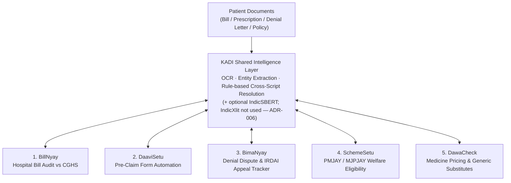

# Project Context — ArogyaRakshak (आरोग्यरक्षक)

> **The single authoritative, continuously updated engineering context, living memory, and operational state for human developers and AI coding agents.**

---

## 1. Project Identity

- **Project Name:** ArogyaRakshak (आरोग्यरक्षक — "Healthcare Protector")
- **Purpose:** A patient-facing, decision-support platform designed to protect Indian citizens from hospital bill overcharging, wrongful insurance claim repudiations, scheme unawareness, and pharmaceutical price gouging.
- **Academic Context:** B.E. Computer Engineering Final Year Project | PES Modern College of Engineering, Pune | SPPU 2019 Pattern.
- **Team Lead:** Viraj Jadhao | Team of 5.
- **Core Mission:** Empower patients at hospital billing desks and insurance claim stages with immediate, plain-language legal/medical audits, automated appeal packages, and scheme discovery in **English, Hindi, and Marathi**.
- **Repository Purpose:** Production-grade modular monorepo containing backend services (`apps/api`), web client (`apps/web`), cross-platform mobile client (`apps/mobile`), shared intelligence layer (`packages/kadi`), and domain reasoning packages (`billnyay`, `daavisetu`, `bimanyay`, `schemesetu`, `dawacheck`).

---

## 2. Current Project Status

- **Current Phase:** Phase 4 (Multilingual, QA & Production Hardening) in progress. Phases 1–3 complete: all assigned Phase-1/2/3 GitHub issues closed as of 2026-09-13; see `docs/academic/presentations/ArogyaRakshak_Current_State_Audit.md` for the full audit trail.
- **Overall Status:** Production Engineering & System Hardening.
- **System Stability:** Functional Production Alpha (All 5 user-facing domain modules wired to real backend endpoints on both Web and Mobile — with the disclosed exception that `POST /billnyay/.../appeal` and `/grievance` are not yet called by either client, tracked separately as #20; 505 backend pytest tests passing; 36 mobile tests passing; 37 web tests passing; Next.js production build passing with 0 errors; Mobile TypeScript check passing with 0 errors; CI guardrails 6/6 passing).
- **Latest (2026-09-27, release-candidate pass — committed on `viraj-dev` as b0cd0eb..576abd1 and pushed to `origin/viraj-dev`):** price-basis correctness in DawaCheck **and** BillNyay (ADR-012), a Postgres-only FK bug fixed (DaaviSetu doctor confirmation) and FK enforcement added to the test DB, demo kit controls (status / reset / Load Scenario A–D, DEMO MODE banner, "What is simulated?"), case timeline, "add a document to this case", honesty fixes across web/mobile, README + `docs/JUDGE_DEMO.md`. Totals: **1011 passed, 6 skipped backend, 93 web, 115 mobile**; web lint 0 / build OK; mobile type-check 0; CI Ruff gate OK; guardrails 8/8. **Runtime-validated:** PostgreSQL 16 (local API against the compose Postgres) and the full docker-compose stack (postgres + api + web images) — `scripts/demo_runtime_smoke.py` 49/49 on both; browser (containerised web: demo reset, Scenario A/C, BillNyay basis, reviewer workspace sign-in). **Not validated:** Android device/emulator (none installed), real Groq (no key configured).
- **Previous (2026-09-27, demo-hardening pass — committed on `viraj-dev` (2eabd17..7a30f45)):** OCR trust pipeline hardened (single medicine trust gate; no uncertain reading dropped), plausibility honesty, four-eyes safety-rule retirement, explicit "Safety check unavailable", mobile processing lifecycle, deterministic demo kit (`demo/`). Current totals: **922 passed, 6 skipped backend, 88 web, 109 mobile**, mobile type-check 0 errors, web lint 0, web build OK, CI Ruff gate OK, CI guardrails 8/8. **Not validated:** mobile on a device/emulator (none available), Postgres (Docker engine did not start), real Groq path (no key configured).
- **Primary Focus (2026-09-15):** Phase 4 hardening — anti-fabrication UI fixes, lightweight security hardening (rate limiting, case-id entropy; full authentication deliberately deferred, see ADR-008), a DawaCheck prescription-shorthand translator, SchemeSetu regional state-name normalization, Hindi/Marathi BillNyay appeal letters, and an E2E latency monitoring harness (#116).
- **Known accepted risks (disclosed, not hidden):** no authentication layer (ADR-008); mobile dependencies carry unresolved advisories pending a major Expo SDK upgrade (see `npm audit` in `apps/mobile`); the evaluation harness covers entity resolution and latency only — PEA/BMA/CFMA/CRMA/WER metrics (#102–#115) remain unmeasured.
- **Active Blockers:** None for currently assigned work.

---

## 3. Product / System Overview

ArogyaRakshak addresses five critical healthcare friction points through non-overlapping, harmonized modules connected by **Kadi**:


```mermaid
flowchart TD
    Doc["Patient Documents<br/>(Bill / Prescription / Denial Letter / Policy)"] --> Kadi["KADI Shared Intelligence Layer<br/>OCR · Entity Extraction · Rule-based Cross-Script Resolution<br/>(+ optional IndicSBERT; IndicXlit not used — ADR-006)"]
    
    Kadi <--> BN["1. BillNyay<br/>Hospital Bill Audit vs CGHS"]
    Kadi <--> DS["2. DaaviSetu<br/>Pre-Claim Form Automation"]
    Kadi <--> BMN["3. BimaNyay<br/>Denial Dispute & IRDAI Appeal Tracker"]
    Kadi <--> SS["4. SchemeSetu<br/>PMJAY / MJPJAY Welfare Eligibility"]
    Kadi <--> DC["5. DawaCheck<br/>Medicine Pricing & Generic Substitutes"]
```

1. **BillNyay (`packages/billnyay`)**: Audits hospital bills line-by-line against Central Government Health Scheme (CGHS) benchmark rates; drafts dispute representation letters to hospital billing management.
2. **DaaviSetu (`packages/daavisetu`)**: Pre-claim automation pre-populating cashless pre-authorization forms and reimbursement claim packages for major private insurers.
3. **BimaNyay (`packages/bimanyay`)**: Post-denial dispute engine auditing claim repudiations against the **IRDAI Master Circular (May 29, 2024)**; auto-generates 3-tier appeals (GRO, Bima Bharosa, Ombudsman Form VI) and tracks statutory SLAs.
4. **SchemeSetu (`packages/schemesetu`)**: Reports provisional **PMJAY** (national) and **MJPJAY** (Maharashtra) eligibility from official criteria cited in `schemesetu/thresholds.py`. Income is non-determinative (neither scheme defines an income ceiling); PMJAY is always `ambiguous` because its criteria (SECC-2011 listing, ASHA/AWW/AWH family, age 70+) are not collected. Empanelled-hospital location is *(planned — not implemented)*.
5. **DawaCheck (`packages/dawacheck`)**: Verifies medicine MRP against NPPA Schedule-I price control caps; recommends low-cost bioequivalent generic substitutes at PMBJP Jan Aushadhi Kendras.
6. **Kadi (`packages/kadi`)**: Central shared intelligence layer providing unified document parsing, entity resolution (edit distance, rule-based cross-script phonetics, optional **IndicSBERT** semantic matching; **IndicXlit** is not used — see ADR-006), ABDM FHIR bundle import, a case graph projection and consent-bounded module auto-triggering.

---

## 4. Architecture Snapshot

- **Backend Gateway (`apps/api`)**: FastAPI async application running under Uvicorn. Implements versioned `/api/v1` routing, async database engine (`asyncpg`), and real-time Server-Sent Events (SSE) status streams.
- **Database & Search**: PostgreSQL 16 (pgvector image; no vector columns or similarity queries are used). `kadi/vector_store.py` is an unwired FAISS/pgvector scaffold — no FAISS index exists. Entity-resolution candidates are blocked by case and entity type instead (ADR-006).
- **LLM Reasoning**: Groq API cloud client (Target model: `openai/gpt-oss-120b`). Deprecated models (`llama3-70b`) are strictly barred.
- **Frontend Clients**:
  - `apps/web`: Next.js 16 App Router, React 19, TypeScript, Vanilla CSS design tokens (Mobile-first, 320px–1280px+, WCAG 2.1 AA).
  - `apps/mobile`: React Native with Expo (TypeScript), client-side document scanner camera.
- **Privacy Architecture**: **Bring-Your-Own-Document (BYOD)**. Uploaded documents exist only in temporary RAM during extraction and are immediately expunged. Zero persistent storage of raw patient documents.

---

## 5. Repository Map

```text
arogyarakshak/
├── apps/
│   ├── api/                     # FastAPI backend application
│   │   ├── app/api/v1/          # Versioned REST endpoints (kadi, billnyay, bimanyay, etc.)
│   │   ├── app/config.py        # Pydantic Settings (DATABASE_URL, GROQ_MODEL)
│   │   ├── app/database.py      # SQLAlchemy async session management
│   │   ├── app/main.py          # FastAPI lifespan, CORS, and error handlers
│   │   ├── app/models.py        # Database ORM models (kadi_cases, bimanyay_cases, etc.)
│   │   └── tests/               # Backend integration test suite (test_api.py)
│   ├── web/                     # Next.js 16 App Router frontend application
│   │   ├── app/components/      # Mobile-first components & module views
│   │   ├── app/globals.css      # Design tokens, fluid typography, touch targets
│   │   ├── app/page.tsx         # Trilingual dashboard with BYOD intake & SSE stream
│   │   └── package.json         # React 19, Next.js dependencies
│   └── mobile/                  # React Native / Expo client (Expo SDK 52, TypeScript, BYOD scanner)
│       ├── App.tsx              # Root component (SafeArea, Theme, Navigation)
│       ├── src/api/             # Shared REST API client matching backend
│       ├── src/components/      # Accessible UI primitives (>= 44px)
│       ├── src/navigation/      # BottomTab + RootStack navigators
│       ├── src/screens/         # HomeScreen, CameraScanScreen, module shells
│       ├── src/services/        # Scanner service & BYOD upload payload
│       ├── src/theme/           # WCAG AA light/dark design tokens
│       └── src/translations/    # Trilingual dictionary (EN, HI, MR)
├── packages/                    # Python domain libraries (installed via pip -e)
│   ├── kadi/                    # Shared context: extraction, vector store, OCR
│   ├── billnyay/                # Hospital bill audit (5-agent reasoning chain)
│   ├── daavisetu/               # Pre-claim cashless pre-auth form generator
│   ├── bimanyay/                # Claim denial dispute & IRDAI appeal tracker
│   ├── schemesetu/              # PMJAY/MJPJAY rule-based eligibility (no RAG, no embeddings)
│   └── dawacheck/               # NPPA Schedule-I price verification & generics
├── data/                        # Government rate schedules (CGHS) and raw test sets
├── docs/                        # Complete documentation portal (architecture, guides, ADRs)
│   ├── architecture/            # Repository structure, components, data flow
│   └── ...                      # Development, API, and configuration guides
├── .github/                     # Workflows (ci.yml), templates, CODEOWNERS
├── PROJECT_CONTEXT.md           # Authoritative living engineering memory (this file)
├── AGENTS.md                    # Master operational manual for AI coding agents
├── CONTRIBUTING.md               # Contributor onboarding & lifecycle guide
├── docker-compose.yml           # Multi-service container orchestration
└── .env.example                 # Environment variable template
```

---

## 6. Technology Stack

| Layer | Component | Version / Provider | Notes |
|---|---|---|---|
| **Language Runtime** | Python | `3.11.x` | Production runtime & CI standard. |
| **Language Runtime** | Node.js | `>= 18.x / 20.x` | Frontend runtime for Next.js & Expo. |
| **Backend Framework** | FastAPI | `0.115.12` | Asynchronous REST & SSE endpoints. |
| **Database ORM** | SQLAlchemy | `2.0.38` | Async sessions with `asyncpg`. |
| **Database** | PostgreSQL | `pg16` | Containerized with `pgvector/pgvector:pg16`. |
| **Vector Engine** | FAISS | *planned* | Unwired scaffold; not used. |
| **LLM Inference** | Groq API | `openai/gpt-oss-120b` | High-throughput cloud inference. |
| **Cross-Script Matching** | Rule-based (Kadi) | — | Devanagari romanization + Indic phonetic keys. IndicXlit is not used (#29). |
| **Embeddings** | IndicSBERT | L3Cube Pune, optional | Cross-lingual similarity; off unless `KADI_SEMANTIC_MATCHING=true`. |
| **Web Client** | Next.js | `16.3.0` / React `19.2.4` | App Router, mobile-first, trilingual UI. |
| **Mobile Client** | Expo / React Native | TypeScript | Document scanner & SLA push alerts. |

---

## 7. Implemented Features

| Feature | Status | Location | Documentation | Automated Tests |
|---|---|---|---|---|
| **Kadi Entity Extraction** | Complete | `packages/kadi/kadi/extraction.py` | `packages/kadi/README.md` | Yes (`test_api.py`) |
| **Kadi Vector Store** | Scaffold (not wired) | `packages/kadi/kadi/vector_store.py` | `docs/architecture/components.md` | No — contains no FAISS and is imported by no endpoint |
| **Kadi OCR Engine** | Complete | `packages/kadi/kadi/ocr/ocr_parser.py` | `packages/kadi/README.md` | Yes (`test_ocr.py`) |
| **BillNyay 5-Agent Pipeline** | Complete (all 5 agents wired) | `packages/billnyay/billnyay/agents/`| `packages/billnyay/README.md` | Yes (`test_agents.py`, `test_api.py`) |
| **DaaviSetu Pre-Auth Generator** | Complete | `packages/daavisetu/daavisetu/generator.py` | `packages/daavisetu/README.md` | Yes (`test_daavisetu.py`) |
| **SchemeSetu Eligibility Agent** | Complete (rule-based, not RAG) | `packages/schemesetu/schemesetu/agent.py` | `packages/schemesetu/README.md` | Yes (`test_schemesetu.py`) |
| **DawaCheck NPPA Benchmarking** | Complete | `packages/dawacheck/dawacheck/checker.py` | `packages/dawacheck/README.md` | Yes (`test_dawacheck.py`) |
| **SSE Real-Time Stream** | Complete | `apps/api/app/api/v1/endpoints/kadi.py` | `docs/architecture/data-flow.md` | Yes (`test_api.py`) |
| **FastAPI Gateway & Models** | Complete | `apps/api/app/` | `apps/api/README.md` | Yes (`test_api.py`) |
| **BimaNyay IRDAI Engine** | Complete | `packages/bimanyay/` | `packages/bimanyay/README.md` | Yes (`test_bimanyay.py`, `test_api.py`) |
| **Mobile-First Trilingual Web App**| Complete | `apps/web/` | `docs/architecture/repository-structure.md` | Yes (`npm run lint`, `npm run build`) |
| **ArogyaRakshak Mobile App** | Complete | `apps/mobile/` | `docs/architecture/bimanyay-and-mobile.md` | Yes (`npm test`) |
| **Clinical Review Layer (ADR-011)** | Complete (no registry verification — adapter reports unavailable) | `packages/kadi/kadi/clinical_review/`, `apps/api/app/clinical/`, `endpoints/clinical_*.py` | `docs/architecture/clinical-review.md` | Yes (`test_clinical_review.py`, `test_clinical_security.py`, `test_clinical_demo_scenarios.py`) |
| **Clinical Safety Governance** | Complete (rules are a disclosed floor) | `kadi/clinical_review/safety.py`, `app/clinical/safety_service.py` | same | Yes (`test_clinical_safety.py`) |
| **Human OCR Resolution** | Complete (text-only, no image retention) | `kadi/clinical_review/transcription.py`, `app/clinical/transcription_service.py` | same | Yes (`test_clinical_transcription.py`) |
| **BillNyay Clinical Plausibility** | Complete (not a necessity determination) | `packages/billnyay/billnyay/plausibility.py` | same | Yes (`test_plausibility.py`) |
| **DaaviSetu Preauth Readiness & Private Playbooks** | Complete (no approval claims) | `packages/daavisetu/daavisetu/readiness.py`, `app/daavisetu_playbooks.py` | same | Yes (`test_readiness.py`, `test_daavisetu_readiness.py`) |
| **Price basis (DawaCheck per unit, BillNyay per day/visit/bottle)** | Complete (convert only from stated counts, else "cannot compare") | `packages/dawacheck/dawacheck/price_basis.py`, `packages/billnyay/billnyay/rate_basis.py`, `kadi.line_items.ground_medicine_source_lines` | ADR-012 | Yes (`test_price_basis.py`, `test_rate_basis.py`, `test_dawacheck_price_basis_pipeline.py`) |
| **Case timeline** | Complete (persisted records only) | `packages/kadi/kadi/timeline.py`, `apps/api/app/case_timeline.py`, web `CaseTimeline.tsx` | `clinical-review.md` §10.7 | Yes (`test_case_timeline.py`, `test_case_timeline_api.py`) |
| **Demo kit controls** | Complete, demo-only | `apps/api/app/clinical/demo_control.py`, `endpoints/clinical_demo.py`, web `components/demo/*` | `docs/JUDGE_DEMO.md`, `demo/README.md` | Yes (`test_demo_control.py`, `scripts/demo_runtime_smoke.py`) |


---

## 8. Current Work

### Active Task (2026-09-27) — release-candidate pass (committed b0cd0eb..576abd1, pushed to `origin/viraj-dev`)
Take the demo-hardened build to a judge-ready release candidate without weakening any
safety gate. Status:
- [x] Phase 1 — DawaCheck price basis end-to-end (package, Kadi grounding, API, web, mobile, Scenario C); the same defect found and fixed in BillNyay's CGHS audit (per-day/visit/bottle rates).
- [x] Phases 2–4 — DEMO MODE banner + "What is simulated?" (server-driven), demo reset / Load Scenario A–D (serialised, idempotent, refused under `APP_ENV=production`), case timeline from persisted records.
- [x] Phases 5/6/10 — raw enums/IDs removed from remaining UI paths; invented example figures removed; misleading PROD / DPDP / "nothing stored" / "mandated cap" / Supreme Court claims corrected.
- [x] Phase 8/13 — review-transition tests (duplicate accept/finalize, reviewer swap, one person as both readers, duplicate ingest); **Postgres-only FK bug fixed**; FK enforcement in the test engine.
- [x] Phase 9 — tracked-file sweep (no secrets/DBs; prescription images are a synthetic public dataset, now documented); `*.db` ignored; demo status discloses nothing outside demo mode.
- [x] Phase 11 — README rewritten for judges; `docs/JUDGE_DEMO.md`; ADR-012; env, API, clinical-review, troubleshooting, testing, demo docs, CHANGELOG.
- [x] Phase 15 — Postgres + full compose stack validated (49/49); browser pass on the containerised web.
- [ ] Android device/emulator run (no emulator on this machine — checklist in `apps/mobile/README.md` §3.5).
- [ ] One real Groq run (no key available).

### Earlier task (2026-09-27) — demo-hardening implementation pass
Make the OCR → human resolution → DawaCheck trust pipeline, the BillNyay clinical-review golden
path, appeal/PDF lifecycle, plausibility, safety governance and mobile processing reliable enough
for a judge demo, with a deterministic demo kit. Committed on `viraj-dev` in seven commits (plausibility, safety, OCR trust, web, mobile, demo kit, docs) and opened as a PR to `main`.

### Status
- [x] OCR trust: `plan_ocr_uncertainty` + `medicine_trust.decide_medicine_trust` (zero-match, ambiguous, over-cap, LLM-normalised, marker-only, whole-line, NOT_APPLIED precedence). `clinical-review.md` §10.
- [x] Entity resolution no longer merges "Pan-D" into "Pan 40" (medicine one-sided variant = conflict; evaluation unchanged).
- [x] Plausibility: conflicting interventions → CLINICAL_REVIEW_RECOMMENDED (`conflicting_items`), more admin exclusions, safety-unavailable handling.
- [x] Safety: four-eyes retirement; `status: UNAVAILABLE` on evaluation failure (web + mobile "Safety check unavailable").
- [x] Appeal/PDF lifecycle covered (supersede, withdraw, cancel, failed re-render rollback, wrong token) — the code was already correct; tests added.
- [x] Web: DawaCheck case-medicine trust panel, honest NOT_APPLIED task state, readable labels/timestamps, distinct provenance/verification badges, reviewer workspace context/COI/finalization checklist, module views gated on processing completion, stream "Refresh status". Browser-verified (Scenario A end to end; Scenario C trust panel and blind reader view); no console errors.
- [x] Mobile: processing state machine + 90 s timeout + Refresh status, shared active case (DaaviSetu/DawaCheck reachable after one scan), stale-response guards, case-medicine card. Unit-tested and type-checked; **not run on a device**.
- [x] Demo kit `demo/` (Scenarios A–D, synthetic documents, demo-mode OCR replay for Scenario C), each scenario an automated test.

### Earlier task (historical)
Product Phase 1 Final Audit Fixes — resolved adversarial audit findings across Kadi background session DB persistence, CameraScan navigation, web file uploader validation, CGHS rates JSON path resolution, mobile offline action queueing, and EasyOCR runtime compatibility.

### Relevant Areas
- `apps/api/app/api/v1/endpoints/kadi.py` & `apps/api/app/database.py`
- `apps/mobile/src/screens/CameraScanScreen.tsx` & `apps/mobile/src/navigation/types.ts`
- `apps/web/app/page.tsx` & `apps/web/app/components/DocumentUploader.tsx`
- `apps/api/app/api/v1/endpoints/billnyay.py` & `packages/billnyay/billnyay/data/cghs_rates.json`
- `apps/mobile/src/screens/` (`DawaCheckScreen`, `SchemeSetuScreen`, `DaaviSetuScreen`, `BimaNyayScreen`)
- `packages/kadi/kadi/ocr/ocr_parser.py` & `packages/kadi/pyproject.toml`

### Current Progress
- [x] P0: `kadi.py` background session resolved via `get_background_session()` with FastAPI dependency override and eager relationship loading (`selectinload`), guaranteeing end-to-end entity persistence in test, local, and Docker environments.
- [x] P0: `CameraScanScreen.tsx` routing updated so `documentType === "general"` routes to `BillNyay` with `caseId` preserved.
- [x] P1: Web `page.tsx` dummy document fallback completely removed; real file selection strictly required.
- [x] P2: CGHS rate schedule resolution made robust with `billnyay.__file__` package path lookup, verified by automated test (`len(CGHS_RATES) > 20`).
- [x] P2: `useOfflineQueue` wired into all statutory mobile screen actions (`BENCHMARK_MEDICINE`, `CHECK_SCHEME`, `SUBMIT_PREAUTH`, `ANALYZE_DENIAL`).
- [x] OCR: EasyOCR / Torch / OpenCV compatibility resolved on supported development environment (`torchvision==0.18.1+cpu`, `numpy<2.0.0`), verified with real image OCR extraction and persistence.
- [x] CI Dependency Fix: Added `reportlab>=4.0.0` to `packages/daavisetu/pyproject.toml`, `apps/api/requirements.txt`, and `.github/workflows/ci.yml` resolving CI runner `ModuleNotFoundError: No module named 'reportlab'`.
- [x] Web CI Test Runner Fix: Updated `test` script in `apps/web/package.json` to `tsx --test` (matching `apps/mobile`), resolving POSIX `/bin/sh` unexpanded glob failure (`Could not find '.../apps/web/tests/**/*.test.ts'`) in Ubuntu CI runner.
- [x] Full regression validation suite executed: 139 backend tests, 27 mobile tests, 25 web tests, web/mobile builds, and CI guardrails all passing (0 failures).

### Current Blockers
None. Ready for Product Phase 2 when directed by user.

---

## 9. Next Tasks

### P0 — Critical (Immediate Sprints)
- [x] **Scaffold BimaNyay Package**: Created `packages/bimanyay` with Pydantic schemas for denial reasons, policy clauses, and appeal outputs.
- [x] **Migrate `bimanyay_*` Tables**: Added `bimanyay_cases`, `bimanyay_grievances`, and `bimanyay_timeline_events` to `apps/api/app/models.py`.
- [x] **Implement IRDAI 3-Tier Drafter**: Built appeal letter templates for Insurer GRO, IRDAI Bima Bharosa complaint narrative, and Ombudsman Form VI.
- [x] **Implement Grievance SLA Tracker**: Built timeline engine calculating 15-day GRO, 15-day Bima Bharosa, and 1-year Ombudsman statutory deadlines.
- [x] **Overhaul Web Frontend (`apps/web`)**: Built mobile-first (320px–1280px+), WCAG 2.1 AA trilingual dashboard with BYOD camera intake and live SSE stream.
- [x] **Scaffold Mobile App (`apps/mobile`)**: Expo React Native TypeScript project with in-app camera document capture (issue #134, closed).

### P1 — High (Core Integration)
- [ ] **Clinical review follow-ups (ADR-011)**: native-speaker Hindi/Marathi copy for clinical UI (and the new hi/mr "passed automated quality check" strings in `apps/mobile/src/translations/strings.ts`); run mobile clinical flows on a device; a real `RegistryVerificationAdapter` only if an authorised registry API becomes available; reviewer notifications.
- [ ] **Validation debt**: Android emulator/device run of scan → processing → modules (checklist: `apps/mobile/README.md` §3.5); one real-Groq run of Scenario A (extraction + appeal letter). *Postgres and the compose stack were validated on 2026-09-27 (49/49); the SAVEPOINT "safety unavailable" path was not forced on Postgres.*
- [x] **DawaCheck unit basis** (ADR-012, 2026-09-27) — also applied to BillNyay CGHS rates.
- [ ] **Native-speaker QA** of the hi/mr strings marked `NEEDS NATIVE-SPEAKER QA` in `apps/web/app/translations.ts` and `apps/mobile/src/translations/strings.ts`.
- [ ] **Devanagari OCR Hardening**: Validate Tesseract / vision OCR pipeline on handwritten Marathi/Hindi prescriptions and faded dot-matrix hospital bills.
- [x] **Kadi Entity Resolution (Phase 3)**: string similarity + rule-based cross-script phonetics + optional IndicSBERT, merge/ask/new branching and feedback-calibrated thresholds (ADR-006). IndicXlit remains blocked on fairseq / Python 3.11 (#29).
- [ ] **Mobile Push SLA Alerts**: Local notifications for 15-day GRO and Bima Bharosa statutory deadlines.

### P2 — Medium (Evaluation & QA)
- [ ] **Implement Benchmark Mapping Accuracy (BMA) Harness**: Build automated evaluation test comparing hospital bills against CGHS codes.
- [ ] **Implement Claim Rejection Mapping Accuracy (CRMA) Harness**: Evaluate BimaNyay against 25 synthetic insurance repudiation scenarios.
- [ ] **Trilingual Copy Polish**: Native speaker review of generated Hindi and Marathi appeal templates.

### P3 — Low (Polish & Presentation)
- [ ] **PDF Digital Signature & Watermarking**: Implement cryptographic hash verification for generated dispute PDFs.
- [ ] **Jan Aushadhi Store Geolocation API**: Embed interactive map of registered PMBJP stores in web and mobile clients.

---

## 10. Prioritized Roadmap

```text
Phase 1: Foundations (COMPLETED)
├── Monorepo scaffolding, Docker Compose, CI pipeline
├── Kadi shared extraction, OCR parser (FAISS vector store: planned, unwired scaffold — see ADR-002/components.md, never built)
├── BillNyay 5-agent chain, DaaviSetu pre-auth generator
├── SchemeSetu rule-based eligibility checker, DawaCheck NPPA price checker
└── Repository-wide documentation & test infrastructure overhaul

Phase 2: Module Builds & BimaNyay (COMPLETED — all assigned issues closed 2026-09-13)
├── Scaffold packages/bimanyay and 5-agent dispute pipeline
├── Build self-reported Grievance SLA escalation tracker
├── Mount /api/v1/bimanyay endpoints in FastAPI
└── Scaffold apps/mobile (Expo React Native) with camera capture (plain expo-camera, no edge detection — README corrected)

Phase 3: Entity Resolution & Cross-Module Intelligence (COMPLETED — all assigned issues closed 2026-09-13)
├── IndicSBERT cross-lingual semantic signal integrated, optional/off by default (ADR-006). IndicXlit transliteration was NOT achieved — blocked on fairseq/Python 3.11 wheels, #29 remains open.
├── Confidence-scored merge/ask-user branching in Kadi implemented and evaluated (docs/evaluation/entity-resolution.md)
├── Auto-triggering: one document upload surfaces insights across all modules
└── Mobile app multi-module screen assembly (BillNyay, BimaNyay, DaaviSetu, SchemeSetu, DawaCheck)

Phase 4: Multilingual & Evaluation (ACTIVE — 2026-09-15)
├── DawaCheck prescription-shorthand translator (#97), SchemeSetu regional state-name normalization (#95), Hindi/Marathi BillNyay appeal letters (#39)
├── E2E latency monitoring harness measured and documented (#116, docs/evaluation/latency.md)
└── Remaining: PEA/BMA/CFMA/CRMA/WER evaluation harnesses (#102–#115, not yet built)

Phase 5: Submission & Demo Polish (FUTURE)
├── Final deployment (college server / staging host)
├── Live end-to-end demo hardening (1 bill upload -> 5 module insights)
└── SPPU academic final project blackbook & documentation sign-off
```

---

## 11. Known Issues

### 1. Global Python 3.14 Path Priority on Windows Host
- **Problem:** Running `python` without activating the virtual environment invokes Python 3.14, which lacks `pytest` and `fastapi`.
- **Impact:** Command fails with `No module named pytest`.
- **Workaround:** Always activate `.venv\Scripts\Activate.ps1` or run directly with `C:\Users\VIRAJ\AppData\Local\Programs\Python\Python311\python.exe`.
- **Status:** Documented in `docs/development/troubleshooting.md`.

### 2. Pytest Asyncio Default Fixture Loop Scope Warning (RESOLVED)
- **Problem:** Deprecation warning during pytest run: `asyncio_default_fixture_loop_scope is unset`.
- **Resolution:** Configured `asyncio_default_fixture_loop_scope = "function"` in root `pytest.ini`.
- **Status:** Closed / Resolved.

---

## 12. Technical Debt

1. **`apps/api/tests/conftest.py` Module Resolution (RESOLVED)**:
   - *Issue*: `from app.main import app` requires pytest to be invoked from inside `apps/api/` or with `PYTHONPATH=apps/api`.
   - *Resolution*: Configured `pythonpath = apps/api` and `testpaths = packages apps/api/tests` in root `pytest.ini`. Root `pytest` command now runs the whole backend suite seamlessly.
   - *Status*: Closed / Resolved.
3. **Business logic in route modules (documented, deferred 2026-09-27)**: `app/clinical/context.py`
   (evidence/plausibility assembly), the supplementary-evidence builder and `refresh_appeal_annex`
   in the BillNyay endpoint, and DawaCheck's per-medicine loop in `endpoints/dawacheck.py` still
   orchestrate package calls inside `apps/api`. Pure decisions were moved to packages
   (`dawacheck.price_basis`, `billnyay.rate_basis`, `kadi.timeline`, `medicine_trust`); the
   remaining orchestration reads the DB and was left in place to avoid a risky rewrite before the
   demo. Candidate: a `app/services/` layer.
4. **Processing status is in memory per API process** (lost on restart; case data are not).
2. **Mock Groq API in Unit Tests**:
   - *Issue*: Some package tests use static mocked responses rather than a unified VCR.py or httpx mock fixture.
   - *Resolution*: Consolidate mock LLM fixtures into a shared test utility in `packages/kadi`.

---

## 13. Important Decisions (ADR Summary)

- **ADR-001 (Monorepo Architecture):** Unified monorepo with editable packages (`pip install -e`) chosen over 7+ fragmented micro-repos for atomic PRs and zero publishing overhead.
- **ADR-002 (Kadi as Shared Infrastructure):** Kadi is the central data extraction and entity resolution foundation, not an isolated 4th module. Document parsing is de-duplicated.
- **ADR-003 (Bring-Your-Own-Document Privacy):** Zero persistent storage of patient health documents. Raw files exist only in transient memory during extraction.
- **ADR-004 (Groq Model Selection):** Hardcoded deprecation ban on `llama3-70b`. All calls dynamically load from `GROQ_MODEL` (default: `openai/gpt-oss-120b`).
- **ADR-005 (DaaviSetu vs BimaNyay Division):** Clean lifecycle separation: DaaviSetu owns pre-claim application filing; BimaNyay owns post-denial repudiation disputes and IRDAI appeals.
- **ADR-011 (Clinical Review & Safety Governance):** Kadi-owned shared layer. Reviewers/institutions hold header-only bearer credentials (no accounts); case holders delegate single reviews with per-request consent; mandatory COI before evidence; immutable, versioned, human-confirmed statements appended verbatim (never via LLM); verification never overstated (no registry integration → at most SELF_DECLARED; DEMO_VERIFIED only in demo mode); plausibility not necessity; readiness not approval; safety rules adopted from named protocols with independent approval; OCR transcription by pharmacists/transcriptionists with two blind readings for medication fields; provenance classes survive downstream.

---

## 14. Constraints & Non-Negotiables

1. **Zero Retention Rule**: Never persist uploaded patient bills, prescription images, or claim denial PDFs to disk or permanent database tables beyond the active extraction session.
2. **Model Grounding**: Never call `llama3-70b` or `llama-3.3-70b-versatile`. Always read from `GROQ_MODEL`.
3. **Fixed Naming Conventions**:
   - Python package names: strictly lowercase (`billnyay`, `daavisetu`, `bimanyay`, `schemesetu`, `dawacheck`, `kadi`).
   - Database tables: prefix with module namespace (`kadi_*`, `billnyay_*`, `daavisetu_*`, `bimanyay_*`, `schemesetu_*`, `dawacheck_*`).
   - API endpoints: `/api/v1/<module>/...`.
4. **Network Boundaries**: Do not introduce dependencies that communicate with network endpoints outside Groq Cloud, the local Postgres container, and official package registries (PyPI, npm).
5. **Multi-Agent Pipeline Separation**: Multi-agent chains must keep each agent's logic and prompt in a separate function/file. Inter-agent communication must use typed Pydantic models.
6. **No Manufactured Clinical Authority (ADR-011)**: AI never writes, finalizes, signs or implies a clinician's statement; human statements reach packages only verbatim via `kadi.clinical_review.annex`; clients show only the server's `verification_label` (never "Verified Doctor"); no output claims medical necessity, approval probability or comprehensive safety coverage.

---

## 15. Testing Status

- **Current totals (2026-09-27, release-candidate pass):** backend `pytest` **1011 passed, 6 skipped** (SQLite with foreign keys enforced); web `npm test` **93**, lint 0, build OK; mobile `npm test` **115**, type-check 0; CI Ruff gate OK; guardrails 8/8; `scripts/demo_runtime_smoke.py` **49/49** on PostgreSQL 16 and on the docker-compose stack. New suites: `packages/dawacheck/tests/test_price_basis.py`, `packages/billnyay/tests/test_rate_basis.py`, `packages/kadi/tests/test_case_timeline.py`, `apps/api/tests/test_dawacheck_price_basis_pipeline.py`, `test_demo_control.py`, `test_case_timeline_api.py`, `test_review_transitions.py`, `apps/web/tests/dawacheck_price_basis.test.ts`, `apps/mobile/tests/price_check.test.ts`.
- **Previous totals (2026-09-27, demo-hardening pass):** backend `pytest` **922 passed, 6 skipped**; web `npm test` **88**, lint 0, build OK; mobile `npm test` **109**, type-check 0; CI Ruff gate OK; `scripts/ci_guardrails.py` 8/8. New suites: `packages/kadi/tests/test_ocr_trust_gate.py`, `apps/api/tests/test_ocr_trust_pipeline.py`, `test_appeal_pdf_lifecycle.py`, `test_safety_unavailable.py`, `test_demo_documents.py`, `test_demo_scenario_c.py`, `apps/web/tests/demo_hardening.test.ts`, `apps/mobile/tests/case_processing.test.ts`. Not run: Postgres, device/emulator, real Groq.
- **Earlier totals (2026-09-23, after ADR-011):** backend `pytest` **835 passed, 6 skipped** (was 686); web `npm test` **74** (was 58), `npm run lint` 0 errors, `npm run build` OK; mobile `npm test` **87** (was 77), `npm run type-check` 0 errors; `scripts/ci_guardrails.py` 8/8.
  - New backend suites: `packages/kadi/tests/test_clinical_review_domain.py`, `test_clinical_annex.py`; `packages/billnyay/tests/test_plausibility.py`; `packages/bimanyay/tests/test_clinical_triggers.py`; `packages/daavisetu/tests/test_readiness.py`; `apps/api/tests/test_clinical_review.py`, `test_clinical_security.py` (adversarial), `test_clinical_safety.py`, `test_clinical_transcription.py`, `test_daavisetu_readiness.py`, `test_clinical_demo_scenarios.py`.
  - New client suites: `apps/web/tests/clinical_review.test.ts`, `apps/mobile/tests/clinical_review.test.ts`.
- *Historical section below (Phase 1).*
- **Unified Pytest Test Runner (`pytest.ini`)**: **139 passed (100% pass rate)**.
  - **Package Unit Suites (`packages/*/tests/`)**: 23 passed.
    - `packages/billnyay`: 4 tests passed (`test_agents.py`)
    - `packages/daavisetu`: 1 test passed (`test_daavisetu.py`)
    - `packages/dawacheck`: 3 tests passed (`test_dawacheck.py`)
    - `packages/kadi`: 6 tests passed (`test_ocr.py` - hardened assertions for line items, amounts, rupee symbols, multi-page PDFs, noise filtering, and summary line exclusions)
    - `packages/schemesetu`: 2 tests passed (`test_schemesetu.py`)
    - `packages/bimanyay`: 7 tests passed (`test_bimanyay.py` - clause auditor, drafter, timeline tracker, and Hindi/Marathi statutory appeal copy validation)
  - **API Integration Suite (`apps/api/tests/test_api.py`)**: 13 passed in 3.65s.
    - `test_health_endpoint`
    - `test_create_and_get_case` (covers case creation, upload, background session, entity persistence, retrieval)
    - `test_dawacheck_benchmark`
    - `test_schemesetu_eligibility`
    - `test_bimanyay_analyze`
    - `test_bimanyay_analyze_multilingual`
    - `test_bimanyay_timeline`
    - `test_daavisetu_claim`
    - `test_billnyay_audit`
    - `test_daavisetu_pdf_download`
    - `test_dawacheck_mobile_samples`
    - `test_cghs_rates_loaded_from_json` (proves full CGHS dataset loaded from JSON, > 20 items)
    - `test_real_image_ocr_upload_and_persistence` (proves real image EasyOCR pipeline executes and persists entities to DB)
- **Frontend Test Suite (`apps/web`)**: `npm test` passed with **10/10 tests passed** (contracts, versioning, routing boundaries, mandatory file upload invariant, trilingual dictionaries).
- **Frontend Linter & Build (`apps/web`)**: `npm run lint` passed with 0 errors, 0 warnings; `npm run build` compiled cleanly in 924ms (Next.js 16.2.10 / Turbopack; 100% static routes).
- **Mobile Client Test Suite (`apps/mobile`)**: `npm test` (`tsx --test`) passed with **17/17 passed in 185ms** (BYOD invariant guard, Kadi upload routing, createCase consent opt-in, multilingual BimaNyay API mapping, scanner payload validation, trilingual dictionary keys, documentType "general" routing with caseId preserved, all 4 statutory offline queue action types).
- **Mobile Client Type-Check (`apps/mobile`)**: `npm run type-check` (`tsc --noEmit`) passed with **0 errors** across all navigation, screens, API types, hooks, and design system components.
- **CI Guardrails (`scripts/ci_guardrails.py`)**: **5/5 checks passed** (BYOD zero-retention invariants, deprecated model ban, package directory lowercase, DB table prefixes, secret leak detection).


---

## 16. Documentation Map

| Area | Primary Document |
|---|---|
| **Portal Sitemap** | [`docs/README.md`](docs/README.md) |
| **System Architecture** | [`docs/architecture/overview.md`](docs/architecture/overview.md) |
| **Component Specifications** | [`docs/architecture/components.md`](docs/architecture/components.md) |
| **Data Flow & Streaming** | [`docs/architecture/data-flow.md`](docs/architecture/data-flow.md) |
| **Architectural Decisions** | [`docs/architecture/decisions/`](docs/architecture/decisions/) |
| **Developer Setup** | [`docs/development/setup.md`](docs/development/setup.md) |
| **Git & Commit Workflow** | [`docs/development/workflow.md`](docs/development/workflow.md) |
| **Testing Strategy** | [`docs/development/testing.md`](docs/development/testing.md) |
| **Troubleshooting Guide** | [`docs/development/troubleshooting.md`](docs/development/troubleshooting.md) |
| **Environment Variables** | [`docs/configuration/environment-variables.md`](docs/configuration/environment-variables.md) |
| **API Endpoints** | [`docs/api/overview.md`](docs/api/overview.md) |
| **BimaNyay & Mobile Blueprint** | [`docs/architecture/bimanyay-and-mobile.md`](docs/architecture/bimanyay-and-mobile.md) |
| **Clinical Review & Safety Governance** | [`docs/architecture/clinical-review.md`](docs/architecture/clinical-review.md) |
| **Agile Planning & Sprints** | [`docs/planning/weekly-sprint-playbook.md`](docs/planning/weekly-sprint-playbook.md) |
| **Academic & Research Portfolio** | [`docs/academic/README.md`](docs/academic/README.md) |
| **Task Backlog** | [`docs/ArogyaRakshak_Task_Backlog.md`](docs/ArogyaRakshak_Task_Backlog.md) |

---

## 17. Recent Changes

### 2026-09-27 — Release-candidate pass (committed on `viraj-dev`: b0cd0eb pricing, 7c7a8ee demo kit, b3d90c9 FK fix, 8e68df3 UI honesty, 576abd1 docs)
- **Correctness (P0)**: DawaCheck compared strip/pack totals with per-tablet ceilings (+1,335% for "Dolo 650: 33"); BillNyay compared per-day/visit/bottle CGHS rates with whole line totals ("Room Rent 3 days" +200% in Scenario A). Both now convert only from stated counts or refuse with a reason (ADR-012). Kadi grounds each medicine to its source line so LLM-normalised names keep "Strip of 15".
- **Postgres (P0, found by runtime validation)**: DaaviSetu doctor-confirmation request → 500 (FK violation; fact rows flushed before their review). Fixed in `clinical/service.py`; `PRAGMA foreign_keys=ON` in the test engine + guard test.
- **Demo kit**: status/reset/scenario routes, DEMO MODE banner, "What is simulated?", Demo controls with one-time persona credentials; Scenario A now loads bill + discharge summary into one case; `APP_ENV=production` refuses demo mode; Dockerfile ships `demo/documents`.
- **Observability**: case timeline (`/kadi/cases/{id}/timeline`) from persisted records; web "Add another document to this case".
- **Honesty/UX**: removed invented example figures; PROD/v1.0/DPDP-compliant/"nothing stored"/"mandated cap"/Supreme Court claims corrected; remaining raw enums/IDs humanised; `.txt` accepted by the web picker; mobile samples declare their basis; dead mock flag removed.
- **Security/privacy**: `*.db` / `test_temp.db` git-ignored; prescription dataset provenance documented (synthetic, public); demo status discloses nothing outside demo mode.
- **Docs**: README (judge-facing), `docs/JUDGE_DEMO.md`, ADR-012, env/API/clinical-review/troubleshooting/testing/demo docs, CHANGELOG.

### 2026-09-27 — Demo-hardening implementation pass (committed on `viraj-dev`)
- **OCR trust (P0)**: readings linking to no medicine, to 2+ medicines, or beyond the cap were dropped and the medicine benchmarked as `AI_DERIVED`; LLM-normalised names lost the uncertainty. Now `plan_ocr_uncertainty` holds such medicines back (`meta.ocr_uncertainty`: `AMBIGUOUS`/`POSSIBLE_MATCH`/`OVER_CAP`/`UNGROUNDED`) and one gate (`kadi/clinical_review/medicine_trust.py`) decides benchmarkability for DawaCheck and evidence packets. Marker-only / no-drug readings refused ("Tab. 40"). Whole-line agreed readings that are exactly the entry are now placed. Escalations are overridden only by a later whole-entry reading.
- **Entity resolution (P1, found while testing)**: "Pan-D" auto-merged into "Pan 40"; medicines now conflict on a one-sided variant letter (evaluation: 0 false merges, identical recall).
- **Plausibility (P1)**: one matching + one conflicting intervention returned PLAUSIBLE → now CLINICAL_REVIEW_RECOMMENDED with `conflicting_items`; more admin lines excluded; unassessed diagnoses stated as not compatible.
- **Safety (P1)**: single-member retirement → four-eyes (request + independent confirm, via audit trail); evaluation failure → `status: UNAVAILABLE` (SAVEPOINT) and "Safety check unavailable" on web/mobile.
- **Mobile (P1)**: first-render race, post-202 audit, stale overwrites, no timeout, DaaviSetu unreachable for a scanned bill — fixed via `services/caseProcessing.ts`, `hooks/useCaseProcessing.ts`, `services/activeCase.ts`. Backend SSE sends `idle` when nothing is in flight.
- **Web (P2)**: module views gated on processing completion; stalled stream → Refresh status; DawaCheck case-medicine trust panel; NOT_APPLIED shown honestly; readable labels; distinct provenance/verification badges; reviewer workspace context + finalization checklist; "Judge-Approved" → "Passed automated quality check"; "Audit Completed" → "Extraction complete".
- **Demo kit**: `demo/` (README, Scenarios A–D, synthetic documents, fixtures list); Scenario C uses a demo-mode-only OCR replay (`app/clinical/demo_ocr.py`) keyed by the committed PNG's SHA-256. Demo prices are per unit (a pack price produced a false "+1356%" in browser verification).
- Docs: `clinical-review.md` §7/§9/§10/§12/§13, ADR-011 amendment, `docs/api/overview.md`, `docs/development/troubleshooting.md`, `apps/mobile/README.md`, CHANGELOG.

### 2026-09-27 — Second forensic audit of `f99945e` (committed in `f793b6a`)
- **OCR cap starvation (P1)**: the 10-task cap was applied before linking, so >10 uncertain letterhead segments hid every medicine line; now `select_uncertain_segments` is uncapped and `create_tasks_from_ocr` caps linked tasks.
- **Unapplied human reading (P1)**: a resolved reading that could not be placed left the entity untouched and the task RESOLVED, so DawaCheck benchmarked the uncertain OCR name as `AI_DERIVED`. Now recorded as `human_transcription.status = NOT_APPLIED`; DawaCheck does not benchmark it; evidence packets mark it unsettled; a later partial reading cannot clear it (only a whole-entry flag can). A leading "Tab."/"Cap." no longer blocks placement.
- **Whole-line readings (P1)**: an uncertain line such as "Tab Augmntn 625mg 1-0-1" did not link to entity "Augmntn" (strength stored separately) and was dropped; linking is now whole-token in both directions, still exactly-one.
- **Safety re-versioning (P1)**: full-text scan results are keyed by rule id; a new version (new id) silently dropped red flags found beyond the excerpt. They now carry forward to the ACTIVE version of the same `rule_key` for terms it still lists (`kadi.clinical_review.safety.carried_forward_terms`).
- **Plausibility coverage (P2)**: `FULL` was reported while a diagnosis was outside the reference; such diagnoses are now `not_assessed_items` (PARTIAL).
- **Reviewer case id (P2)**: reviewer-facing review responses no longer include `case_id` (`serializers.reviewer_review_summary`).
- Verified correct as claimed: PDF re-render/re-sign on finalize/withdraw/supersede/cancel (atomic with the status change; a failed render rolls back), patient-only notice, admin-line exclusion, directory/demo lockout, approval rounds, web failure banner.

### 2026-09-26 — ADR-011 audit fixes (top issues)
- **OCR tasks**: created only when an uncertain reading links (whole tokens) to exactly one extracted medicine; "Rx"/"Tab."/short tokens, prescriber/identity lines and non-clinical fields are skipped; context keeps only medication-looking neighbour lines; resolutions substitute only the uncertain token; partial-field flags refused; cap 10/document.
- **Stale signed PDF**: `app/clinical/events.py` listener — finalize/withdraw/supersede/cancel re-renders and re-signs the stored BillNyay appeal PDF annex (older downloads then fail verify).
- **Insurer-facing notice**: PDF annex only when a statement exists; `clinical_statement_notice` is patient-facing only (BillNyay and BimaNyay).
- **Plausibility**: administrative bill lines excluded; PLAUSIBLE lists `not_assessed_items` (`coverage: PARTIAL`).
- **Coverage**: upload-time full-text safety scan (`kadi_safety_scan_results`, rule id/version/terms only, purged with case); readiness discloses `evidence_scope_note`.
- **Directory**: only EXTERNALLY_VERIFIED (or demo in demo mode) reviewers listed; assign-by-ID in web/mobile; demo reviewers locked out when demo mode is off.
- **Safety rules**: approvals bound to a submission round; unchanged resubmission after rejection starts fresh.
- **UI**: explicit safety-check failure state (web/mobile). **Mobile**: DaaviSetu scans return to DaaviSetu (`returnTo`); DaaviSetu/DawaCheck/BimaNyay wait for processing (SSE) before reading the case.
- Tests after: backend 853 passed / 6 skipped; web 78 (lint 0); mobile 92 (type-check 0). Web changes browser-verified; mobile not run on a device.

### 2026-09-23 — Human clinical review & safety governance (ADR-011)
- **Shared layer**: `packages/kadi/kadi/clinical_review/` (types/provenance, statement lifecycle, evidence packets, verification adapter, safety rules, transcription consensus, verbatim annex); `apps/api/app/clinical/` (credentials, sanitized audit, services, purge, demo seed); endpoints `clinical_review.py`, `clinical_safety.py`, `clinical_transcription.py`, `clinical_demo.py` under `/api/v1/kadi`.
- **Tables** (new only): `kadi_clinical_reviewers`, `kadi_clinical_reviews`, `kadi_clinical_statements`, `kadi_clinical_fact_confirmations`, `kadi_clinical_audit_events`, `kadi_safety_rules`, `kadi_safety_rule_approvals`, `kadi_transcription_tasks`, `kadi_transcription_assignments`, `kadi_transcription_submissions`, `daavisetu_institutions`, `daavisetu_playbooks`.
- **Modules**: BillNyay `GET .../clinical-plausibility` and appeal annex (response + PDF); BimaNyay `clinical_review` trigger on `/analyze` and `GET .../clinical-statements`; DaaviSetu institutions, playbooks, `POST .../readiness`, clinical-fact confirmation, readiness in the claim ZIP; DawaCheck never benchmarks an unresolved reading, adds `name_provenance`.
- **Anti-fabrication fixes found during inspection**: Barrister prompt now forbids implying any clinician's opinion; offline appeal template (en/hi/mr) no longer states that "the treating physician's records evidence the necessity" — hi/mr rewording needs native-speaker QA.
- **Kadi OCR**: `parse_document` returns `ocr_segments` (EasyOCR confidence, images only); upload pipeline creates transcription tasks for low-confidence segments (redacted text + bbox only — no image).
- **Config**: `CLINICAL_GOVERNANCE_ADMIN_KEY` (empty = disabled), `CLINICAL_DEMO_MODE`, `OCR_LOW_CONFIDENCE_THRESHOLD`, `SAFETY_RULE_REQUIRED_APPROVALS` — in `config.py`, `.env.example`, `docker-compose.yml`, env docs; CORS allows the new headers.
- **Web**: `app/lib/clinical.ts`, `app/components/clinical/*`, `/clinical-review` workspace; module views integrated; home page safety banner. **Mobile**: `ClinicalReviewCard`, `ClinicalWorkflowCards` (safety, readiness, transcription); BimaNyay/DawaCheck screens now read the route `caseId`.
- Builds on the uncommitted BillNyay-appeal/DaaviSetu-package client wiring (#20) that was already in the working tree.

### 2026-09-13
- **SchemeSetu income criteria replaced with cited official criteria** (`packages/schemesetu/schemesetu/thresholds.py`):
  - The PMJAY ₹2,50,000 and MJPJAY ₹1,50,000 limits (`UNVERIFIED_PROJECT_HEURISTIC`) were removed. Official sources define no single income ceiling: AB PM-JAY uses SECC-2011 deprivation/occupational criteria, state-verified databases, ASHA/AWW/AWH families and all persons aged 70+ irrespective of income (PIB releases 2116209, 28 Mar 2025, and 2053883, 11 Sep 2024); MJPJAY covers all families in Maharashtra under the GR dated 28 July 2023, integrated scheme from 1 July 2024 (Government of Maharashtra district portals; the GR text and jeevandayee.gov.in could not be retrieved).
  - Income is now non-determinative everywhere (`agent.py`, `reasoning_agent.py`, `triggers.py` #92, `trend_estimator.py`, `transition_adviser.py`, `apps/api/app/auto_triggers.py`). PMJAY is always `ambiguous` with verification steps; MJPJAY follows state of residence; results carry `criteria_provenance` and `sources`; `confidence_score` removed.
  - The #92 trigger fires when a scheme newly applies (first profile or move into Maharashtra) and returns `NO_CHANGE` otherwise; income changes alone never fire.
  - Web `SchemeSetuView` and mobile `SchemeSetuScreen` render `ambiguous` as "Verification needed" (not "Not Eligible") and show sources. New hi/mr strings need native-speaker QA.

### 2026-09-09
- **Documentation Directory Restructuring & Modernization**:
  - Restructured `docs/` into distinct engineering, planning, and academic directories (`architecture/`, `api/`, `configuration/`, `development/`, `planning/`, `academic/`).
  - Pruned obsolete, duplicate, and unrelated assets (`IndiaAI_Student_User_Manual.docx.pdf`, empty `docs/final/`, legacy duplicate PDFs and outdated decks from `v1/` and `v2/`).
  - Relocated and consolidated academic deliverables, presentations, viva defense notes, and research papers under `docs/academic/` with a comprehensive index.
  - Organized sprint playbooks, team division strategy, and futuristic roadmap under `docs/planning/`.
  - Moved BimaNyay and Mobile architecture specification to `docs/architecture/bimanyay-and-mobile.md` and diagrams to `docs/architecture/diagrams/`.
  - Updated developer guides (`setup.md`, `testing.md`) to include `bimanyay` and `apps/mobile` testing (42 tests passing across backend and mobile).
- **Repository Documentation & Agent Readiness Overhaul**:
  - Authored comprehensive root `README.md`, `CONTRIBUTING.md`, `CODE_OF_CONDUCT.md`, `SECURITY.md`, `CHANGELOG.md`, `LICENSE`, and `.gitattributes`.
  - Created `.github` templates (Bug Report, Feature Request, PR Template, CODEOWNERS, `.github/AGENTS.md`).
  - Structured `/docs` hierarchy into `architecture/`, `development/`, `configuration/`, `api/`, and `decisions/` (ADR-001 through ADR-005).
  - Modernized READMEs across `apps/api`, `apps/web`, `packages/kadi`, `billnyay`, `daavisetu`, `schemesetu`, `dawacheck`, and `data`.
- **BimaNyay & Mobile Architecture Locked**:
  - Codified the IRDAI 3-tier escalation ladder (GRO 15d -> Bima Bharosa 15d -> Insurance Ombudsman Form VI up to ₹50L).
  - Formulated the Zero-Overlap Boundary Matrix separating DaaviSetu (pre-claim) and BimaNyay (post-denial).
  - Designed the fully functional 5-module mobile client architecture (`apps/mobile`).
  - Updated task backlog with discrete GitHub issues for BimaNyay and Mobile App.
- **BimaNyay Insurance Denial Engine Implemented**:
  - Built `packages/bimanyay` with `clause_auditor.py` (5-Year Moratorium, unapproved exclusions, room rent capping, delayed intimation audit).
  - Built `drafter.py` generating Level 1 GRO appeal, Level 2 Bima Bharosa (2,000-char compliant text), and Level 3 Ombudsman Form VI statement of facts.
  - Built `tracker.py` computing statutory SLA timeline milestones (15d GRO, 15d Bima Bharosa, 365d Ombudsman).
  - Wired ORM models (`bimanyay_cases`, `bimanyay_grievances`, `bimanyay_timeline_events`) into `apps/api/app/models.py`.
  - Registered `/api/v1/bimanyay` endpoints in `apps/api/app/api/v1/endpoints/bimanyay.py` and `api.py`.
- **Mobile-First Trilingual Web Dashboard Overhauled**:
  - Overhauled `apps/web` with responsive design tokens in `globals.css` (320px–1280px+, WCAG 2.1 AA contrast, touch targets >= 44px).
  - Implemented trilingual UI dictionary in `translations.ts` supporting English, Hindi (हिंदी), and Marathi (मराठी).
- **Verification Audit P1 Fixes, Touch-Target Hardening & OCR Rigor**:
  - Hardened mobile touch targets in `apps/web/app/globals.css`: added `min-width: var(--min-touch-target)` (44px x 44px) to `.lang-btn` and `.tab-btn`, `min-height: var(--min-touch-target)` to `.brand-logo`, and introduced `.consent-wrapper` for full 44px checkbox tap area meeting WCAG 2.1 SC 2.5.5 / WCAG 2.2 SC 2.5.8.
  - Eliminated all Pydantic deprecation warnings: converted `apps/api/app/config.py` to `SettingsConfigDict` and confirmed zero schema warnings.
  - Hardened OCR test suite in `packages/kadi/kadi/ocr/tests/test_ocr.py` with 6 exhaustive unit tests asserting exact item names, float prices, rupee symbol formatting, multi-page PDFs, noise filtering, and summary exclusions.
  - Fixed summary filtering bug in `packages/kadi/kadi/ocr/ocr_parser.py` (preventing `Total Bill` from parsing as a billable hospital line item while preserving clinical procedure names like `Total Knee Replacement`).
  - Added root `pytest.ini` resolving `apps/api` pythonpath (resolving Technical Debt #1) and setting `asyncio_default_fixture_loop_scope = "function"` (resolving Known Issue #2).
  - Clean unified test execution: `pytest` runs all 29 tests (21 package + 8 API) with 0 warnings in 2.45s.
- **Verification Audit P2 Improvements, Theme Switcher & Trilingual BimaNyay Polish**:
  - **Accessible Light/Dark Theme Switcher**:
    - Implemented WCAG 2.1 AA compliant `[data-theme="light"]` token overrides in `apps/web/app/globals.css` covering surface, borders, high-contrast text, brand accents, and elevated cards.
    - Added dedicated theme switcher button (`.theme-toggle-btn`) in `apps/web/app/components/Header.tsx` meeting the minimum 44px x 44px touch target (`--min-touch-target: 44px`) with accessible `aria-label` and `title`.
    - Wired state management in `apps/web/app/page.tsx` with lazy initialization checking `localStorage` and `prefers-color-scheme`, synchronizing cleanly to `document.documentElement` without hydration flicker or React 19 linter warnings.
  - **Vetted Hindi & Marathi Statutory Legal Drafter in BimaNyay**:
    - Enhanced `packages/bimanyay/bimanyay/drafter.py` to produce authentic Indian statutory copy across all 3 escalation tiers in English, Hindi (`hi`), and Marathi (`mr`):
      - *Level 1 (GRO Appeal)*: विधिक सांविधिक अपील / वैधानिक अपील citing IRDAI Master Circular (May 29, 2024) Clause 16 (5-Year Moratorium rule) and mandatory 3-member Claims Review Committee (CRC) approval.
      - *Level 2 (Bima Bharosa IGMS)*: Structured regulatory grievance narrative bounded strictly within the 2,000-character portal limit.
      - *Level 3 (Insurance Ombudsman Form VI)*: Formal Statement of Facts (हकीकतीचे निवेदन / तथ्यों का विवरण) under Rule 14(1)(b) of Insurance Ombudsman Rules, 2017.
    - Extended `analyze_insurance_denial(input_data, language: str = "en")` in `packages/bimanyay/bimanyay/__init__.py` and API endpoint `POST /api/v1/bimanyay/analyze` to support `language` query parameter.
    - Wired `apps/web/app/components/modules/BimaNyayView.tsx` to dynamically request and render vetted legal documents according to the active language (`currentLang`).
  - **Comprehensive Test Suite & CI Validation**:
    - Added unit tests `test_drafter_hindi_output` and `test_drafter_marathi_output` in `packages/bimanyay/tests/test_bimanyay.py` (7/7 tests passing).
    - Added integration test `test_bimanyay_analyze_multilingual` in `apps/api/tests/test_api.py` (9/9 tests passing).
    - Unified test execution: **32/32 tests passing with 0 warnings in 2.49s**.
    - Frontend verification: `npm run lint` (0 errors, 0 warnings) and `npm run build` (compiled in 865ms, 100% static routes).
  - **GitHub Issue Tracking**:
    - Updated issues #122, #123, #126, and #127 with verification test logs and implementation details.

- **Mobile App Foundation (`apps/mobile`) Scaffolded & Foundation Gaps Closed**:
  - Scaffolded cross-platform mobile client with **Expo SDK 52**, **React Native 0.76 (New Architecture enabled)**, and strict **TypeScript** (`tsconfig.json` with `@/*` aliases).
  - Built **Design System** in `src/theme/` mirroring web app tokens: dark base (`#0a0e17`), light base (`#f8fafc`), brand cyan (`#06b6d4`), fluid typography, and strictly enforced 44px touch targets (`--min-touch-target: 44px` / WCAG 2.1 SC 2.5.5).
  - Implemented **Trilingual Dictionary** in `src/translations/` supporting English, Hindi (`हिंदी`), and Marathi (`मराठी`).
  - Built **React Navigation Foundation** in `src/navigation/` with `BottomTabNavigator` (Home, BillNyay, DaaviSetu, BimaNyay, SchemeSetu, DawaCheck) and `RootNavigator` with modal camera presentation.
  - Implemented **Shared API Gateway Client** in `src/api/` with timeouts, normalized error payloads, and strongly typed routes mapped to all 5 domain endpoints and Kadi context layer.
  - Built **Real `expo-camera` Hardware Capture** in `src/screens/CameraScanScreen.tsx` with native `CameraView`, `useCameraPermissions()` reactive permission card, flash toggle, high-resolution `takePictureAsync({ quality: 0.85 })`, and graceful simulator/headless fallback.
  - Implemented **Kadi Case Creation & Multipart Ingestion Pipeline** in `src/services/scanner.ts` and `src/api/endpoints.ts`: `processScanAndUpload()` creates a case via `api.kadi.createCase({ consent_opt_in: true })` and posts multipart document data to `/api/v1/kadi/cases/{caseId}/upload`.
  - Enforced strict **BYOD Zero-Retention Invariant**: raw documents exist only in transient memory during extraction and are immediately expunged; persistent offline storage explicitly rejects raw medical records.
  - Implemented **Offline-First Architecture Hooks** in `src/hooks/`: `useNetworkStatus`, `useOfflineStorage` (with secure storage and BYOD guard), and `OfflineBanner`.
  - Scaffolded **Accessible UI Primitives** in `src/components/`: `Header` (with BYOD badge, language and theme toggles), `Button` (>= 44px), `Card`, `Badge`, and `OfflineBanner`.
  - Built **Foundational Screen Shells** in `src/screens/`: `HomeScreen`, `BillNyayScreen`, `DaaviSetuScreen`, `BimaNyayScreen`, `SchemeSetuScreen`, and `DawaCheckScreen`.
  - Authored **Automated Mobile Test Suite** in `tests/`: 10 tests across 4 suites covering BYOD invariant guard, Kadi upload routing contracts, consent opt-in, multilingual BimaNyay API mapping, scanner payload validation, and trilingual dictionary integrity (`npm test` via native `tsx --test`).
  - Authored comprehensive developer documentation in `apps/mobile/README.md`.
  - Created GitHub Issue [#134](https://github.com/Viraj281105/Arogyarakshak/issues/134) and documented verification results and gap closures in comment [#5599098873](https://github.com/Viraj281105/Arogyarakshak/issues/134#issuecomment-5599098873).
  - Validated with `npm run type-check` (`tsc --noEmit` passing with 0 errors) and `npm test` (10/10 passed).

- **Product Phase 1: Full-Stack Web & Mobile Module API Integration Complete**:
  - **Universal Web Module Wiring (`apps/web`)**:
    - Created unified `useApi` hook in `apps/web/app/hooks/useApi.ts` providing standardized async lifecycle handling (loading, error, data states, AbortController timeout).
    - Updated `page.tsx` to pass active `caseId` across all module views.
    - Replaced all static/client-side string templates in module views with live backend endpoints:
      - `BillNyayView.tsx`: Calls `POST /api/v1/billnyay/cases/{caseId}/audit`, rendering live CGHS benchmark deviations, room rent capping, unbundled charges, and audit item breakdown.
      - `DawaCheckView.tsx`: Calls `POST /api/v1/dawacheck/benchmark`, verifying brand MRP against NPPA Schedule-I ceiling rates and surfacing PMBJP Jan Aushadhi generic equivalents.
      - `SchemeSetuView.tsx`: Calls `POST /api/v1/schemesetu/eligibility`, sending income, state, category, and medical procedure to retrieve PMJAY/MJPJAY eligibility scores and step-by-step claim guides.
      - `BimaNyayView.tsx`: Calls `POST /api/v1/bimanyay/analyze` (with language parameter) and `POST /api/v1/bimanyay/timeline`, displaying regulatory violations, reversal probability, multi-tier appeal drafts (GRO, Bima Bharosa, Ombudsman), and statutory SLA tracking.
      - `DaaviSetuView.tsx`: Calls `POST /api/v1/daavisetu/cases/{caseId}/claim`, retrieving auto-populated cashless pre-authorization claim packages.
    - Verified `apps/web`: `npm run lint` (0 errors, 0 warnings) and `npm run build` (Next.js 16 production build succeeded).
  - **Universal Mobile Module Wiring (`apps/mobile`)**:
    - Aligned mobile API request/response types in `src/api/types.ts` and route bindings in `src/api/endpoints.ts` with FastAPI schemas.
    - Implemented full API integration across all 5 mobile module screens:
      - `BillNyayScreen.tsx`: Kadi case creation, document upload, and `api.billnyay.audit` execution with live charged vs CGHS benchmark stats.
      - `BimaNyayScreen.tsx`: Policy repudiation intake form, `api.bimanyay.analyze` with trilingual support, 3-tier appeal tabs, native `Share.share` draft export, and SLA timeline.
      - `DaaviSetuScreen.tsx`: Pre-auth form generation via `api.daavisetu.submitClaim` with live claim ID and field breakdown.
      - `SchemeSetuScreen.tsx`: Demographics & procedure intake form, `api.schemesetu.checkEligibility` evaluation, match confidence badges, and claim guide steps.
      - `DawaCheckScreen.tsx`: NPPA ceiling rate audit form via `api.dawacheck.benchmark`, quick sample pill selectors, generic substitute locator, and camera scan integration.
    - Replaced external clipboard dependency with native `Share.share` in `BimaNyayScreen.tsx` (zero additional native dependencies required).
    - Verified `apps/mobile`: `npm run type-check` (`tsc --noEmit` passed with 0 errors) and `npm test` (10/10 tests passed).

- **CI/CD Pipeline Production Hardening (`.github/workflows/ci.yml` & `scripts/ci_guardrails.py`)**:
  - Replaced basic 56-line test script with an enterprise multi-stage CI/CD pipeline featuring **6 parallel, specialized stages**:
    1. **Architectural Invariants & Security Guard** (`governance-and-invariants`): Standalone Python scanner (`scripts/ci_guardrails.py`) validating BYOD zero-retention (zero persistent document directories), model grounding (prohibiting deprecated Groq models `llama3-70b` and `llama-3.3-70b-versatile`), lowercase monorepo package hygiene, database table prefix conventions (`kadi_*`, `billnyay_*`, etc.), and accidental API key leak prevention.
    2. **Backend Integration & Domain Matrix** (`backend-ci`): PostgreSQL 16 + `pgvector` service container with health checks, pip caching, install of all 6 local packages (`kadi`, `billnyay`, `daavisetu`, `bimanyay`, `schemesetu`, `dawacheck`), Ruff static analysis, full pytest execution with term/XML coverage reporting, and coverage artifact upload.
    3. **Web Client Production Gate** (`web-ci`): Node.js 20 with npm caching, Next.js build cache restoration, ESLint check (`npm run lint`), and Next.js 16 production build verification (`npm run build`).
    4. **Mobile Client Production Gate** (`mobile-ci`): Node.js 20 with npm caching, TypeScript type-check (`npm run type-check`), and complete test suite execution (`npm test`).
    5. **Docker Infrastructure Verification** (`docker-verification`): Docker Compose configuration validation (`docker compose config --quiet`), Buildx layer caching via GitHub Actions cache (`type=gha`), and dry-run container builds for `apps/api/Dockerfile` (fixed missing `bimanyay` package) and `apps/web/Dockerfile`.
    6. **Unified Branch Protection Gate** (`ci-gate`): Aggregates all upstream job results into a rich markdown GitHub Step Summary table and outputs a single green checkmark for GitHub branch protection rule enforcement.
  - Configured concurrency cancellation (`cancel-in-progress: true`) to automatically kill obsolete runs on branch updates and prevent compute exhaustion.

---

- **Product Phase 1: Independent Audit Fixes Completed**:
  - **P0: Mobile Camera → Kadi → Module Flow & Real Entity Extraction**:
    - Fixed `CameraScanScreen.tsx` to automatically route back to destination modules (`BillNyay`, `BimaNyay`, `DawaCheck`) passing `{ caseId, scanCompleted: true }`.
    - Updated `BottomTabParamList` to accept route parameters.
    - Eliminated all dummy `data:text/plain;base64,` base64 uploads from `BillNyayScreen.tsx` and `DaaviSetuScreen.tsx`.
    - Connected Kadi background document ingestion (`apps/api/app/api/v1/endpoints/kadi.py`) to real `extract_entities_from_text` (Groq API or regex/heuristic fallback), persisting clinical entities (`hospital`, `patient`, `diagnosis`, `procedure`, `medicine`) in addition to billing line items.
    - Updated `packages/kadi/kadi/ocr/ocr_parser.py` with UTF-8/plain-text decoding fallback prior to PyMuPDF to gracefully handle text document uploads without crashes.
  - **P1: Configured Groq Inference & Trilingual Form Localization**:
    - Replaced hardcoded Groq fallback in `apps/api/app/api/v1/endpoints/billnyay.py` with real `GroqClient` instantiated using `settings.groq_model` and `settings.groq_api_key`.
    - Expanded `apps/mobile/src/translations/strings.ts` with comprehensive form labels, placeholders, buttons, statutory badges, and audit results across English, Hindi, and Marathi.
    - Localized all mobile screens (`BillNyayScreen`, `DaaviSetuScreen`, `BimaNyayScreen`, `SchemeSetuScreen`, `DawaCheckScreen`).
  - **P1: Mobile SSE Streaming & Real-Time Feedback**:
    - Created `useSSEStream` hook in `apps/mobile/src/hooks/useSSEStream.ts` supporting standard EventSource and fetch-based streaming from `/api/v1/kadi/cases/{caseId}/stream`.
    - Implemented `AgentStreamVisualizer` component in `apps/mobile/src/components/AgentStreamVisualizer.tsx` displaying live multi-agent stage indicators, progress percentage, and log messages.
  - **P1: Meaningful Web UI & Mobile User-Flow Tests**:
    - Created web test suite in `apps/web/tests/` (`translations.test.ts`, `useApi.test.ts`, `contracts.test.ts`) running via `npm test` with 9 passing tests.
    - Created mobile test suite in `apps/mobile/tests/screen_and_flow.test.ts` verifying camera scan routing contracts, screen params, trilingual dictionary parity, SSE stream parsing, and offline queue serialization with 15 passing tests.
  - **P2: DawaCheck 404s, CGHS 2024 Rates, DaaviSetu PDF & Offline Queue**:
    - Added NPPA Schedule-I ceiling rates for all 4 mobile sample medicines (`Dolo 650mg`, `Augmentin 625 Duo`, `Metformin 500mg SR`, `Meropenem 1g`) plus fuzzy alias matching in `packages/dawacheck/dawacheck/checker.py`.
    - Created comprehensive CGHS 2024 rate schedule in `packages/billnyay/billnyay/data/cghs_rates.json` and dynamically loaded in `billnyay.py`.
    - Implemented real IRDAI Standard Pre-Authorization Form (Annexure-B) PDF generation in `packages/daavisetu/daavisetu/generator.py` via ReportLab and exposed `GET /api/v1/daavisetu/cases/{case_id}/claim/pdf` with web and mobile download buttons.
    - Implemented `useOfflineQueue` hook in `apps/mobile/src/hooks/useOfflineQueue.ts` leveraging secure storage with automatic queue draining on network reconnect, strictly adhering to BYOD zero-retention.

---

## 18. Agent Handoff Notes

### Latest handoff (2026-09-27, release-candidate pass)
- Committed in five groups on `viraj-dev` (b0cd0eb, 7c7a8ee, b3d90c9, 8e68df3, 576abd1) and pushed to `origin/viraj-dev`; not yet merged to `main`.
- Before touching prices read ADR-012: never compare an amount whose basis is unknown; `is_overcharged` / `deviation_percentage` are `null` when not compared and clients must not render a verdict.
- The test DB now enforces foreign keys. If a new flow inserts child rows by plain FK, `await db.flush()` after the parent.
- Demo: `docs/JUDGE_DEMO.md`. Validate any stack with `python scripts/demo_runtime_smoke.py --api <url> --admin-key <key>` (49 checks, resets afterwards).
- Remaining debt: Android run, real Groq run, hi/mr QA (`NEEDS NATIVE-SPEAKER QA` markers), route-level orchestration (§12.3), in-memory processing status.
- Windows gotcha: scripted edits must write with `newline=""` (CRLF broke a regex test once this pass).

### Latest handoff (2026-09-27, demo-hardening pass)
- Committed on `viraj-dev` on top of `f793b6a` (2eabd17 plausibility, 9921bb7 safety, a808537 OCR trust, 67eca60 web, 732ecc0 mobile, ed50f5d demo kit, then docs) and opened as a PR to `main`. Backend 922 passed, 6 skipped; web 88 / lint 0 / build OK; mobile 109 / type-check 0; guardrails 8/8.
- Read `docs/architecture/clinical-review.md` §10 before touching OCR/transcription/DawaCheck: the trust invariant is enforced by `test_ocr_trust_gate.py`, `test_ocr_trust_pipeline.py`, `test_demo_scenario_c.py`. Do not add a benchmarking fallback to OCR/AI names for held-back entries.
- Demo: `demo/README.md`. Scenario C's replay only works with the committed PNG, byte-identical, in demo mode.
- Not validated in this pass: Postgres (Docker Desktop was launched but its engine never came up; the local PostgreSQL 18 service is stopped and needs elevation), Android device/emulator (SDK has adb only — no emulator package, system image or AVD), real Groq.
- Residual risks: DawaCheck per-unit vs pack prices; EasyOCR confidently misread words are not flagged; `UNGROUNDED` is token-based and conservative; processing status is in-memory single-process (`idle` after restart); hi/mr copy needs QA; web uploader creates one case per upload (Scenario A's discharge summary is test-only).

### Latest handoff (2026-09-27, second ADR-011 audit)
- ADR-011 is committed (`3aae7af`, `f99945e`). The second-audit fixes are committed in `f793b6a`.
- Invariant now enforced by tests, for uncertain readings that LINK to exactly one medicine (and are within the 10-task cap): the entry is not benchmarked until readers agree, and an agreed reading that cannot be placed stays `NOT_APPLIED` (not benchmarked) until a whole-entry flag settles it — a later partial reading cannot clear it. Readings that link to no medicine, to 2+ medicines, or beyond the cap are NOT covered (see residual gaps).
- Known residual gaps (documented in `clinical-review.md` §10/§12, not fixed): readings that link to no medicine or to 2+ medicines, or linked readings beyond the 10-task cap, are dropped and the medicine is benchmarked as `AI_DERIVED` (e.g. LLM-rewritten names); task cards show a resolved `NOT_APPLIED` task as a green "Human-confirmed reading" without `resolution_reason` (the DawaCheck note explains it); one board member can retire an active safety rule alone; mobile screens can fetch once before the SSE stream starts and have no stream timeout.
- Mobile has still never been run on a device or emulator (no Android SDK on the dev machine used for the audit).

### Earlier handoff (2026-09-23, ADR-011)
- Read `docs/architecture/clinical-review.md` §1 (who does what), §3 (credentials), §12 (limitations) before touching this layer.
- Invariants tests enforce: no "Verified Doctor" wording; finalize needs the exact confirmation sentence; drafts never visible to case holders; audit details free of clinical text; case deletion leaves no case-scoped clinical rows; playbooks never cross institutions.
- Gotcha: pytest collects `packages/*/tests` and `apps/api/tests` without `__init__.py`, so test module basenames must be unique (hence `test_clinical_review_domain.py` in Kadi).
- Local demo: set `CLINICAL_DEMO_MODE=true` and `CLINICAL_GOVERNANCE_ADMIN_KEY`, `POST /api/v1/kadi/clinical-demo/seed`, then follow §13 of the doc.
- Next: native-speaker review of clinical copy (web/mobile are English-only for it), device test of mobile cards.

### Last Completed Work (historical)
Successfully fixed and verified all Product Phase 1 issues based on the independent audit across P0, P1, and P2 priority levels:
1. **Camera → Kadi → Module Flow**: Real flow established; dummy base64 strings removed; caseId routed cleanly.
2. **Kadi Entity Extraction**: Real entity extraction wired into background pipeline with clinical entity persistence.
3. **Inference Grounding**: Configured Groq inference used in `billnyay.py`.
4. **Mobile Localization**: All 5 mobile module forms localized in English, Hindi, and Marathi.
5. **Mobile SSE Streaming**: Live status stream connected with `AgentStreamVisualizer`.
6. **DaaviSetu PDF Generation**: Live IRDAI Annexure-B PDF generated and downloadable on Web and Mobile.
7. **DawaCheck Sample 404s**: Fully resolved with expanded NPPA Schedule-I rates and alias matching.
8. **BillNyay CGHS Dataset**: Benchmark dataset codified in `cghs_rates.json` and wired to audit endpoint.
9. **Mobile Offline Action Queue**: Enqueue and automatic replay implemented via `useOfflineQueue`.
10. **Web CI Test Runner Script**: Configured `test` in `apps/web/package.json` to `tsx --test` to match `apps/mobile`, preventing POSIX `sh` glob unexpansion in Linux CI runners.
11. **Validation Suite Results**:
    - Backend: `pytest` passed **139/139 tests** (100%).
    - Web: `npm test` passed **25/25 tests**; `npm run lint` passed **0 errors**; Next.js production build passing.
    - Mobile: `npm test` passed **27/27 tests**; `npm run type-check` passed **0 errors**.
    - CI Guardrails: `python scripts/ci_guardrails.py` passed **5/5 checks**.

### Current State (as of the entry above, historical)
Product Phase 1 audit fixes were 100% complete and verified at this point in the log. **This
entry is historical, not current** — Phases 2 and 3 have since been completed (all assigned
issues closed 2026-09-13) and Phase 4 is now in progress. See §2 "Current Project Status" at
the top of this document for the live status.

### Recommended Next Action
When authorized by the user, begin Product Phase 2:
1. Advance IndicXlit phonetic transliteration & IndicSBERT cross-lingual semantic matching in `packages/kadi`.
2. Expand entity graph and cross-module context sharing in Kadi.

---

## 19. Definition of Done & Pre-Commit Agent Checklist

Before any AI coding agent considers a task or session complete, it must execute the **Implementation → Documentation Gate**:

```markdown
- [ ] Implementation completed adhering to module boundaries
- [ ] Relevant unit & integration tests added or updated
- [ ] Backend tests executed: `python -m pytest apps/api` and `python -m pytest packages/`
- [ ] Frontend linter executed: `npm run lint` in `apps/web` (if frontend touched)
- [ ] BYOD zero-retention verified (no persistent document storage introduced)
- [ ] Model grounding verified (uses GROQ_MODEL, no deprecated llama models)
- [ ] Relevant documentation updated (READMEs, docs/architecture, docs/api, etc.)
- [ ] PROJECT_CONTEXT.md updated (Current Work, Recent Changes, Agent Handoff Notes)
- [ ] Git diff inspected to verify no unintended or temporary files remain
```
