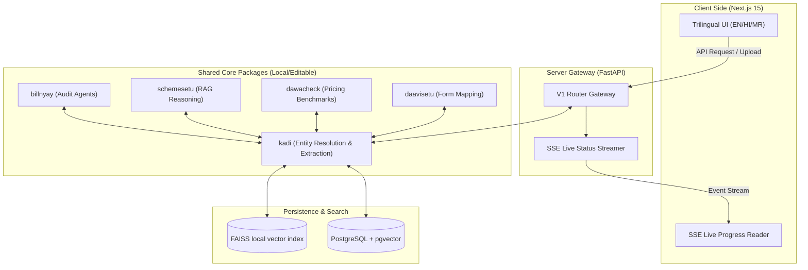

# ArogyaRakshak (आरोग्यरक्षक)

> **Patient-facing bill audit, scheme eligibility, and medicine pricing platform with trilingual support (English, Hindi, Marathi).**

**B.E. Computer Engineering Final Year Project | PES Modern College of Engineering, Pune | SPPU 2019 Pattern**
*Team of 5 | Status: Approved & Active Development (Phase 1 Foundations Completed)*

---

## 🌟 Vision & Overview

In the Indian healthcare landscape, patients often face complex billing structures, high pharmaceutical markups, and lack of clarity on eligibility for government health insurance. **ArogyaRakshak** is a unified, automated decision-support system designed to empower patients by:
1. **Bill Auditing & Grievance Drafting (BillNyay)**: Auditing hospital charges against standard government benchmarks (CGHS) and auto-generating compliant IRDAI grievance appeals.
2. **Scheme Eligibility Recommendation (SchemeSetu)**: Assessing patient diagnostics and demographics against national and state insurance parameters (PMJAY/MJPJAY) via semantic search.
3. **Medicine Price Check & Generic Alternatives (DawaCheck)**: Verifying drug retail prices against NPPA Schedule-I ceiling rates and recommending geographical store searches (Jan Aushadhi).
4. **Cashless Pre-Authorization Assistant (DaaviSetu)**: Pre-populating insurance claim packages into standard formats dynamically.

All modules interoperate seamlessly through **Kadi**—a shared context and entity resolution layer that ensures a single document upload (prescription, bill, or rejection letter) generates cross-cutting insights without redundant patient effort.

---

## 🛠️ System Architecture

ArogyaRakshak is designed as a modular monorepo, decoupling business logic into lightweight, editable packages and exposing unified services via Docker containers.



---

## 📋 Repository Structure

```
arogyarakshak/
├── .github/
│   └── workflows/
│       └── ci.yml             # Github Actions CI pipeline (lint + pytest)
├── apps/
│   ├── web/                   # Next.js 15 frontend application
│   └── api/                   # FastAPI backend application
│       ├── app/
│       │   ├── api/           # Versioned endpoint routes
│       │   ├── config.py      # Pydantic Settings configurations
│       │   ├── database.py    # SQLAlchemy session initialization
│       │   ├── main.py        # FastAPI lifecycle and error handlers
│       │   └── models.py      # DB schemas (Kadi & Module entities)
│       └── tests/             # pytest integration suites
├── packages/                  # Domain logic packages (linked as editable in Python)
│   ├── kadi/                  # Entity extraction, phonetic transliteration (IndicXlit), and Vector Stores
│   ├── billnyay/              # Multi-agent auditing and grievance drafting protocols
│   ├── schemesetu/            # Scheme rules matching & offline semantic embeddings (ONNX fallback)
│   ├── dawacheck/             # Medicine pricing checks & NPPA brand-to-generic mappings
│   └── daavisetu/             # Insurer cashless pre-authorization mapping
├── data/                      # Structured government rate schedules and circular parsers
├── docs/                      # Technical specification backlog
└── docker-compose.yml         # Container orchestration spec
```

---

## 🚀 Tech Stack & Core Libraries

| Layer | Technology | Rationale / Choice |
|---|---|---|
| **Frontend** | **Next.js 15 + React 19** | Modern, fast client-side rendering with built-in trilingual i18n scaffolding. |
| **Backend** | **FastAPI** | High-performance asynchronous API framework utilizing Python typing rules. |
| **Database** | **PostgreSQL (pg16) + pgvector** | Robust relational persistence combined with native vector embeddings support. |
| **Vector Index** | **FAISS** | In-memory similarity matching for sub-second database blocking checks. |
| **Translation** | **IndicXlit (AI4Bharat)** | Machine transliteration supporting phonetic mapping across Indic scripts. |
| **Semantic Matching**| **IndicSBERT (L3Cube, Pune)**| High accuracy cross-lingual embeddings optimized for Indian local dialects. |
| **Inference Engine** | **Groq API** | Centralized API client (default: `openai/gpt-oss-120b`). * llama3-70b is deprecated. |

---

## 💻 Quick Start & Installation

### Prerequisites
* [Docker Desktop](https://www.docker.com/products/docker-desktop/) (includes Docker Compose)
* [Python 3.11+](https://www.python.org/downloads/) (for running backend tests locally)
* [Node.js 18+](https://nodejs.org/) (for running frontend dev server locally)

### Running with Docker Compose (Recommended)
1. **Configure Environment Variables**:
   Copy the example environment template and populate real API keys:
   ```bash
   cp .env.example .env
   ```
   > [!IMPORTANT]
   > Update the `GROQ_API_KEY` inside `.env` to enable LLM-based entity extraction and appeal drafting.

2. **Spin Up the Containers**:
   Build and start all database, backend, and frontend services:
   ```bash
   docker-compose up --build
   ```

3. **Verify API Connectivity**:
   Check if the API and database checks pass:
   ```bash
   curl http://localhost:8000/health
   # Expected Output: {"status":"ok","version":"1.0.0"}
   ```

---

## 🧪 Testing & Verification

Automated tests are located in `apps/api/tests/` and run against the FastAPI client.

### Run Tests Locally
To execute the pytest suite manually outside Docker:
```bash
# 1. Switch to backend app directory
cd apps/api

# 2. Execute pytest via Python module runner
python -m pytest
```

### GitHub Actions CI
The [.github/workflows/ci.yml](file:///.github/workflows/ci.yml) workflow triggers on every push and pull request to `main` branch, running code lints and validating tests against a mock Postgres database.

---

## 📖 Key Documentation Links
- **[ArogyaRakshak Technical Documentation](file:///docs/v1/ArogyaRakshak_Technical_Documentation.md)**: Deep dive into modules architecture, data schemas, and translation specifications.
- **[Task Backlog](file:///docs/ArogyaRakshak_Task_Backlog.md)**: Roadmap, milestone checklists, and target metrics.
