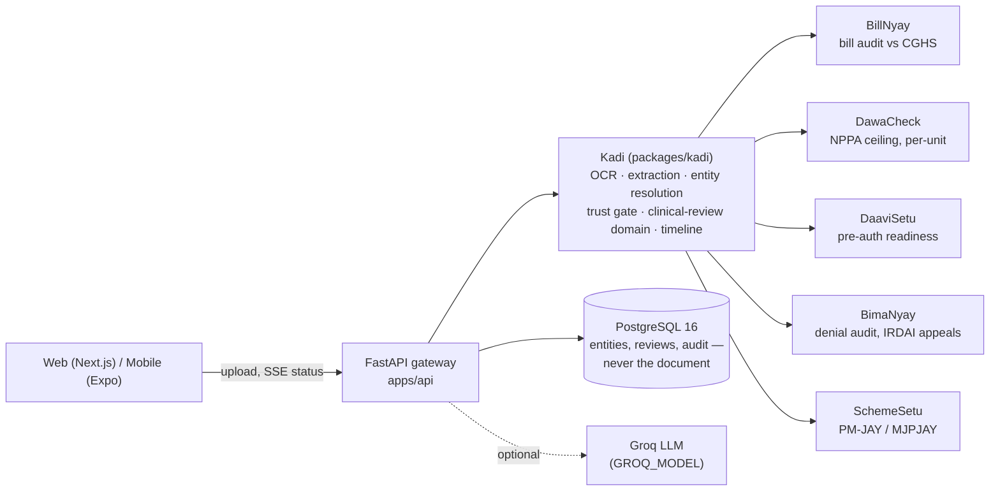

<div align="center">

# ArogyaRakshak (आरोग्यरक्षक)

[](https://github.com/Viraj281105/Arogyarakshak/actions/workflows/ci.yml)
[](https://www.python.org/)
[](https://fastapi.tiangolo.com)
[](https://nextjs.org)
[](LICENSE)

**Evidence-first decision support for Indian patients facing hospital bills, insurance denials and medicine prices — where every machine output says what it is, and anything uncertain goes to a named human before anyone acts on it.**

*B.E. Computer Engineering final-year project · PES Modern College of Engineering, Pune · SPPU 2019 pattern · Team lead: Viraj Jadhao*
*Status: **release candidate of an academic prototype** — not a production medical, legal or financial service.*

[Judge demo guide](docs/JUDGE_DEMO.md) · [Demo kit](demo/README.md) · [Architecture](docs/architecture/overview.md) · [Trust & review model](docs/architecture/clinical-review.md) · [API](docs/api/overview.md)

</div>

---

## 1. The problem

A family at a hospital billing desk or holding an insurance rejection letter usually has no way to check what they are told:

- **Hospital bills** carry line items far above government reference rates (CGHS), bundled items billed separately, and medicines above NPPA price ceilings.
- **Insurance denials** cite clauses the IRDAI Master Circular (29 May 2024) restricts — for example pre-existing-condition exclusions after the 5-year moratorium.
- **Pre-authorization** fails for missing paperwork nobody told the patient about.
- **Welfare schemes** (PM-JAY, MJPJAY) go unused because eligibility is opaque.

## 2. Why typical "healthcare AI" fails here

- **It sounds certain when it is not.** An OCR misread ("Augmntn") or an LLM "correction" of a drug name silently becomes a fact, and a price check or appeal is built on it.
- **It compares incompatible things.** A strip price (₹33 for 15 tablets) against a per-tablet ceiling (₹2.30) produces an absurd "overcharged by 1,335%".
- **It manufactures authority.** Generated letters imply a doctor agreed; dashboards show green "verified" badges nobody verified.
- **It keeps what it should not.** Uploaded medical documents end up on disk "for convenience".

## 3. What ArogyaRakshak does

A patient uploads a document (bill, prescription, discharge summary, denial letter). The shared **Kadi** layer extracts entities in memory and discards the file. Five modules then work on the case — but only on information that has been **settled**:

- uncertain readings are **held back** and sent to **two independent human readers** (blind to each other and to the software's guess);
- prices are compared **per unit or not at all**;
- clinical questions go to a **named, conflict-declared doctor** whose statement is attached **verbatim** — never rewritten by the software;
- every step is recorded in an **append-only audit trail** and shown to the patient as a plain-language **case timeline**.

## 4. Architecture


```mermaid
flowchart LR
    U["Web (Next.js) / Mobile (Expo)"] -->|upload, SSE status| API["FastAPI gateway<br/>apps/api"]
    API --> K["Kadi (packages/kadi)<br/>OCR · extraction · entity resolution<br/>trust gate · clinical-review domain · timeline"]
    K --> BN["BillNyay<br/>bill audit vs CGHS"]
    K --> DC["DawaCheck<br/>NPPA ceiling, per-unit"]
    K --> DS["DaaviSetu<br/>pre-auth readiness"]
    K --> BM["BimaNyay<br/>denial audit, IRDAI appeals"]
    K --> SS["SchemeSetu<br/>PM-JAY / MJPJAY"]
    API --> DB[("PostgreSQL 16<br/>entities, reviews, audit —<br/>never the document")]
    API -. optional .-> G["Groq LLM<br/>(GROQ_MODEL)"]
```

Domain packages are pure Python and DB-agnostic; persistence lives in `apps/api`. Details: [overview](docs/architecture/overview.md), [components](docs/architecture/components.md), [ADRs](docs/architecture/decisions/).

## 5. Modules

| Module | What it does | Reference data |
|---|---|---|
| **Kadi** (`packages/kadi`) | Transient OCR (EasyOCR/PyMuPDF), rule-based or Groq extraction, cross-script entity resolution, OCR-uncertainty plan, medicine trust gate, clinical-review domain, case timeline | — |
| **BillNyay** | Line-by-line bill audit, clinical plausibility (not necessity), 5-agent appeal letter, signed PDF | CGHS rate subset (curated JSON) |
| **DawaCheck** | Medicine price vs NPPA ceiling **per tablet/capsule/vial**, with an explicit price basis; generic suggestions | 7-formulation curated NPPA subset |
| **DaaviSetu** | Pre-authorization documentation readiness (never approval odds), institution playbooks, Annexure-B PDF | Generic checklist + private playbooks |
| **BimaNyay** | Denial clause audit, 3-tier appeals (GRO → Bima Bharosa → Ombudsman), SLA tracker | IRDAI Master Circular 2024 (cited clauses) |
| **SchemeSetu** | Provisional PM-JAY / MJPJAY eligibility with sources (income is non-determinative) | Cited official criteria |

## 6. Trust model

Every value carries its provenance and is shown with it:

| Provenance | Meaning | Shown as |
|---|---|---|
| `AI_DERIVED` | Read or generated by software | "Machine-derived" |
| `HUMAN_REVIEWED` | Two independent readers agreed on it | "Human-reviewed" |
| `HUMAN_AUTHORED` | Written by a named reviewer, verbatim | "Human-authored" |

Rules the code enforces (and tests pin):

- **Trust gate** (`kadi.clinical_review.medicine_trust`): a medicine whose reading is open, disputed, ambiguous, only-resembling, over the task cap or not applicable is **never price-checked**.
- **Price basis** (`dawacheck.price_basis`, ADR-012): a billed amount is converted to a per-unit price only from a stated strip/pack size or quantity; otherwise **"Cannot compare reliably"** — never a percentage.
- **Plausibility is not necessity**: conflicting procedures → "Clinical review recommended"; administrative lines excluded; "not assessed" is distinct from "compatible".
- **Safety floor**: board-approved keyword rules; a failed evaluation shows **"Safety check unavailable"**, never "no issue".
- **No manufactured authority**: verification labels come only from the server; no reviewer is checked against a real medical council (none is integrated), so the best a real reviewer shows is "Self-declared"; demo personas show "Demo verification only".

## 7. Human-in-the-loop design

- **OCR readers** (pharmacist / transcriptionist): two blind readings; agreement settles the entry, disagreement escalates to "confirm with the pharmacist".
- **Clinical reviewers** (doctors): patient consent per review → assignment by ID → mandatory conflict-of-interest declaration before evidence opens → private draft → lock → finalize with an explicit confirmation sentence. Finalized statements are immutable and versioned; withdrawal or supersession re-signs the stored appeal PDF.
- **Safety governance**: rules need independent board approval to activate and two members to retire.

## 8. Privacy and retention

- The **uploaded file is never stored** — it is processed in memory. Only a SHA-256 digest (duplicate guard), extracted entities, and a **redacted** 1,000-character excerpt are kept.
- The patient's name is extracted in memory and **not persisted**; the excerpt is stripped of names, phone numbers, Aadhaar/PAN and addresses (direct identifiers only — this is not formal anonymisation).
- A case is deleted on request (`DELETE /api/v1/kadi/cases/{id}`) or automatically after `CASE_TTL_DAYS` (default 90). Deletion removes everything derived from the case, including clinical-review records and signed PDFs.
- Per-case access tokens (ADR-009); **there is no user-account authentication** (ADR-008, accepted risk for this scope).
- Designed around DPDP Act 2023 data-minimisation principles; **no compliance certification is claimed**.

## 9. Demo mode

`CLINICAL_DEMO_MODE=true` (never with `APP_ENV=production` — the API refuses to start) enables a deterministic demo kit:

- a striped **DEMO MODE** banner with a live **"What is simulated?"** panel (web and reviewer workspace);
- **Demo controls**: *Reset demo*, *Load Scenario A–E* (a fresh case whose synthetic documents run through the real upload pipeline) and one-time demo persona credentials;
- deterministic OCR replay for the committed Scenario C image only.

What is simulated: the documents, the reviewer personas and their "Demo verification only" status, the demo safety rules and playbooks, and Scenario C's OCR confidences. Everything else is the real code path. See [docs/JUDGE_DEMO.md](docs/JUDGE_DEMO.md).

## 10. Setup

```bash
git clone https://github.com/Viraj281105/Arogyarakshak.git && cd Arogyarakshak
cp .env.example .env            # GROQ_API_KEY optional: without it extraction is rule-based and deterministic
docker compose up --build       # postgres + api (:8000) + web (:3000)
```

Local (no Docker for the API): Python 3.11, `pip install -r apps/api/requirements.txt` and `pip install -e packages/<each>`, then `uvicorn app.main:app` from `apps/api`; `npm install && npm run dev` in `apps/web`. Full guide: [docs/development/setup.md](docs/development/setup.md).

## 11. Testing

```bash
python -m pytest                          # backend: packages + API (SQLite with foreign keys enforced)
cd apps/web && npm test && npm run lint && npm run build
cd apps/mobile && npm test && npm run type-check
python scripts/ci_guardrails.py           # BYOD, model ban, table prefixes, secrets, port binding
python scripts/demo_runtime_smoke.py --api http://127.0.0.1:8000 --admin-key <key>   # A–D over HTTP against a running API
```

Latest local results (2026-09-27): backend **1,011 passed, 6 skipped**; web **93**; mobile **115**; guardrails **8/8**; demo runtime smoke **49/49 on PostgreSQL 16**. Exact numbers are kept current in [PROJECT_CONTEXT.md](PROJECT_CONTEXT.md#15-testing-status).

## 12. Demo scenarios

| | Scenario | Shows |
|---|---|---|
| A | Bill + discharge summary → plausibility conflict → named doctor's statement → signed appeal PDF | Human-authored vs machine-derived, immutable statement, PDF re-signing |
| B | Pre-auth request → readiness checklist → doctor confirms a clinical fact | "Needs a doctor's confirmation", no approval odds |
| C | Prescription with unclear handwriting → trust gate → two blind readers → per-tablet price check | Held-back medicines, consensus, price basis |
| D | Denial letter mentioning stroke signs → safety escalation → four-eyes retirement | Safety floor, governance |

Scripts: [demo/scenarios/](demo/scenarios/). Each is also an automated test.

## 13. Limitations (said out loud)

- Reference data are **curated subsets** (7 NPPA formulations, a CGHS subset, a 6-code plausibility table) — absence from them proves nothing.
- A **confidently misread** OCR word is not detectable; only low-confidence readings are routed to humans.
- Conservative name matching can hold back legitimate abbreviations (safe, but more human work).
- Processing status is **in memory per API process** (lost on restart; the case data are not).
- **Hindi/Marathi** copy needs native-speaker review.
- No real registry verification of reviewers; no user accounts; keyword safety rules miss paraphrase and negation.

## 14. Implemented vs planned

| Status | Items |
|---|---|
| **IMPLEMENTED** | Kadi pipeline, trust gate, human transcription consensus, DawaCheck price basis, BillNyay audit/plausibility/appeal/signed PDF, clinical review & safety governance, DaaviSetu readiness, BimaNyay appeals/SLA, SchemeSetu, case timeline, per-case tokens, retention sweep, demo kit |
| **DEMO-ONLY** | Synthetic documents, demo personas and "Demo verification only", demo safety rules/playbook, Scenario C OCR replay, demo reset / scenario loaders |
| **PLANNED (not implemented)** | Real registry verification, FAISS/pgvector search (`kadi/vector_store.py` is an unwired scaffold), IndicXlit (blocked, #29), outcome probabilities (no dataset, #90), Jan Aushadhi store map |
| **NOT RUNTIME-VERIFIED** | Mobile app on a device/emulator (statically tested only), real Groq inference (no key available during verification) |

---

[Contributing](CONTRIBUTING.md) · [Security](SECURITY.md) · [Changelog](CHANGELOG.md) · [Agent manual](AGENTS.md) · MIT [License](LICENSE)
