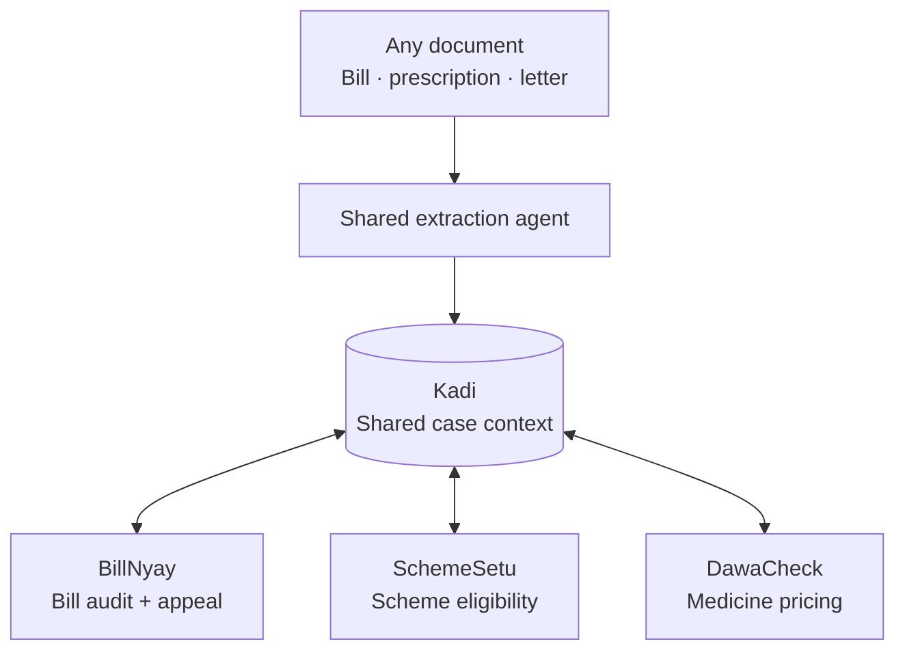
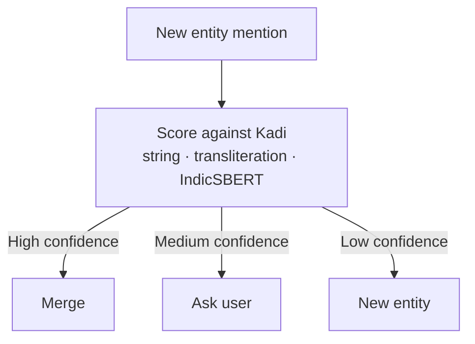

# ArogyaRakshak — Technical Project Documentation

**B.E. Computer Engineering | PES Modern College of Engineering, Pune | SPPU 2019 Pattern**
**Team Lead: Viraj Jadhao | Team of 5 | Status: Approved by guide — moving to implementation**
**Document v2 — supersedes the initial project brief | Updated 12 July 2026**

---

## 1. Overview

Patients upload a hospital bill, a prescription, or an insurance rejection letter, and get an instant plain-language read on whether they've been overcharged or denied unfairly — plus a ready-to-file appeal or a list of government schemes they didn't know they qualified for. English, Hindi, and Marathi, full support, all three modules.

Selected from five candidate FYP ideas (ArogyaRakshak, ClimateX, CivicEye AI, CourtPrep AI, TenderGuard AI) on real end-user reach, public-data-only access, and an existing hackathon build to extend rather than a cold start. The full candidate comparison lives in the project selection dossier prepared for guide review — this document is the working technical spec going forward and is the one to keep updating as the build progresses.

---

## 2. System Architecture

Three modules no longer operate as isolated pipelines. They share one context layer — **Kadi** — so a single document upload can surface insights across all three without the user re-uploading anything.



Any document type triggers the same shared extraction step, lands in Kadi's case context, and from there any of the three modules can read what's already known and write back what they find — that's what "linked, not just co-located" means in practice.

---

## 3. The Three Modules

### BillNyay
*(formerly BillGuard — renamed for consistency with SchemeSetu/DawaCheck; "Nyay" = justice)*

Upload a hospital bill → OCR extracts line items → benchmarks against CGHS government rates → flags overcharges → 5-agent pipeline (Document Auditor → Clinical Reviewer → Regulatory Advisor → Appeal Drafter → QA Judge) drafts an IRDAI-compliant appeal letter as a PDF. This module already covers insurance rejection/appeal handling — that's the Appeal Drafter + QA Judge agents at work, not a separate feature.

**Status:** carrying forward and refining the existing hackathon build, not rebuilding from scratch.

### SchemeSetu

User answers a short intake or uploads a bill/prescription → RAG layer over PMJAY (national) and MJPJAY (Maharashtra state) scheme documents → agent reasons through eligibility rules → outputs which scheme(s) apply and a step-by-step claim guide.

### DawaCheck

Upload a medicine strip photo or prescription → OCR reads drug name/batch → benchmarks MRP against NPPA ceiling prices for Schedule-I formulations (~800–900 price-controlled drugs) → flags overcharging → suggests generic substitutes. Deliberately scoped to Schedule-I only — it's the one segment with a clean, finite, government-published ground-truth price to check against.

---

## 4. Kadi — Shared Context Layer

*(कड़ी — "link," as in a link in a chain)*

The connective layer that makes the three modules genuinely interoperate instead of just sitting on one platform. Not a fourth module — infrastructure all three modules depend on.

### 4.1 Case & entity model

| Table | Purpose |
|---|---|
| `cases` | One record per patient session/case — the anchor everything else attaches to |
| `entities` | Extracted structured data (medicine, hospital, procedure, amount, category), tagged by type |
| `case_entities` | Links entities to the case and the document/module that produced them |

Sits alongside each module's own domain tables (CGHS rates, PMJAY/MJPJAY rules, NPPA prices) in the same Postgres instance — not a new database, a new layer in the one you've already got.

### 4.2 Shared extraction agent

One extraction agent normalizes any input document (bill, prescription, rejection letter) into a common schema — hospital, diagnosis/procedure, medicines, amount, date, category — rather than each module running its own bespoke parser. Harder to build well than three separate simple ones, but it's what lets the three modules speak the same language.

### 4.3 Entity resolution pipeline

The genuinely hard, genuinely defensible piece — full version, cross-script included, per team decision.



Three similarity signals feed the confidence score:

| Signal | Catches | Tool |
|---|---|---|
| String similarity | Surface variants — "Paracetamol 650mg" vs "Paracetamol" | Edit distance / token overlap |
| Transliteration matching | Same word, different script — क्रोसिन ↔ Crocin | **IndicXlit** (AI4Bharat) — `pip install ai4bharat-transliteration`, MIT-licensed, supports Hindi + Marathi among 21 Indic languages |
| Semantic/cross-lingual similarity | Translated concepts, not transliterations — बुखार ↔ Fever | **IndicSBERT** (L3Cube, Pune) — `l3cube-pune/indic-sentence-similarity-sbert` via `sentence-transformers`; outperforms generic multilingual models (LaBSE etc.) specifically on Hindi/Marathi/English cross-lingual similarity |

Both tools are open-source and pretrained — no training pipeline of your own required, which is what keeps the "real version" actually feasible for a 5-person team on an FYP timeline. Blocking happens within a case (and by entity type) before scoring, so this stays cheap — it doesn't need to scale beyond a handful of documents per case.

A small logistic regression combining the three signal scores into one confidence value is a reasonable, legitimate approach — real ML, not overkill.

**Free win:** the medicine entity-resolution work and DawaCheck's "generic substitute" feature need the same brand-name ↔ active-ingredient mapping. Build it once, both features benefit.

### 4.4 Auto-triggering

Once Kadi has enough context, it can proactively fire other modules without a re-upload. Bill mentions a ₹4L cardiac surgery under general category → Kadi checks SchemeSetu eligibility in the background and surfaces it alongside the BillNyay report. This is also the strongest live-demo moment: one upload, three insights.

### 4.5 Consent boundary

User explicitly opts in per-case to letting SchemeSetu and DawaCheck see what BillNyay found, rather than data being pooled silently by default. Cheap to build, and a good answer to have ready if the data-handling question comes up in viva.

---

## 5. Multilingual Strategy — English, Hindi & Marathi (full scope)

Cross-cutting across all three modules and Kadi — touches OCR, UI, LLM output generation, and entity resolution independently.

- **OCR on Devanagari script** needs its own validation pass — accuracy on non-Latin scripts is a separate technical risk from English OCR, needs a real Devanagari test set early.
- **Source-vs-generation distinction** (still open, see §12): whether PMJAY/MJPJAY/CGHS/NPPA source documents exist natively in Hindi/Marathi determines whether "Marathi support" for that data source means ingesting native-language source data (RAG/parsing) or generating Marathi output from English source data (LLM generation) — different engineering tasks, scoped per data source.
- **Terminology QA**: a native/fluent Hindi and Marathi speaker reviews generated appeal letters and scheme explanations for substantive correctness, not just fluency.
- **Cross-script entity matching**: handled by Kadi's entity resolution pipeline (§4.3) via IndicXlit + IndicSBERT. Worth keeping distinct in your own head from UI/output-language generation — related, but a different system.

---

## 6. Technology Stack

| Layer | Technology |
|---|---|
| Backend | FastAPI |
| Frontend | Next.js 15 |
| Database | PostgreSQL + pgvector |
| Vector search | FAISS |
| LLM inference | Groq API |
| Transliteration | IndicXlit (AI4Bharat) |
| Cross-lingual embeddings | IndicSBERT (L3Cube) |
| Containerisation | Docker Compose |

> **Action required before further build work:** the original build used `llama3-70b` on Groq. Groq deprecated the 70B/8B Llama models on 17 June 2026. Re-point the pipeline to `openai/gpt-oss-120b` (or `qwen/qwen3.6-27b`). Verify against Groq's live deprecations page before committing, as availability shifts.

---

## 7. Data Sourcing

| Module/Layer | Data needed | Format / risk |
|---|---|---|
| BillNyay | CGHS rate schedules | Public PDF, English — scraping/parsing job |
| SchemeSetu | PMJAY (national) + MJPJAY (Maharashtra) eligibility rules, empanelled hospital lists | Public PDFs/circulars — confirm Hindi/Marathi availability first |
| DawaCheck | NPPA Schedule-I ceiling price list (~800–900 formulations) | Public, likely English/structured — verify current publication format |
| Kadi (entity resolution) | Labeled entity-pair dataset ("these two mentions are/aren't the same entity") | New requirement — fold into the existing self-donated test-document effort rather than treating as a separate workstream |

---

## 8. Naming Conventions

| Element | Name |
|---|---|
| Project | ArogyaRakshak |
| Module 1 | BillNyay |
| Module 2 | SchemeSetu |
| Module 3 | DawaCheck |
| Shared context layer | Kadi |
| Python package naming | lowercase, e.g. `billnyay`, `schemesetu`, `dawacheck`, `kadi` |
| DB table prefixes | `kadi_cases`, `kadi_entities`, `billnyay_cghs_rates`, `schemesetu_pmjay_rules`, `dawacheck_nppa_prices` |
| API route prefixes | `/api/billnyay/...`, `/api/schemesetu/...`, `/api/dawacheck/...`, `/api/kadi/...` |

---

## 9. Repository Structure

**Monorepo** — resolved this session. With Kadi as shared infrastructure all three modules depend on, three separate repos would mean painful cross-repo dependency management for no real benefit at this team size.

```
arogyarakshak/
├── apps/
│   ├── web/              # Next.js 15 frontend
│   └── api/               # FastAPI backend
├── packages/
│   ├── kadi/               # shared context: extraction, entity resolution, orchestration
│   ├── billnyay/
│   ├── schemesetu/
│   └── dawacheck/
├── data/                   # CGHS / PMJAY / MJPJAY / NPPA ingestion scripts + processed data
├── docs/                   # this file and future documentation
└── docker-compose.yml
```

---

## 10. Team Roles

| # | Role | Scope |
|---|---|---|
| 1 | Pipeline / orchestration | Multi-agent reasoning across all three modules **and** Kadi's entity resolution pipeline — the heaviest single role now that Kadi exists |
| 2 | OCR + data layer | Document ingestion, OCR incl. Devanagari validation, RAG ingestion for all reference datasets |
| 3 | Frontend / UX | Next.js interface, trilingual UI |
| 4 | Infra / deployment | Docker, database, SSE streaming, hosting |
| 5 | Data + legal/eval + multilingual QA | Government data structuring, IRDAI/scheme rule accuracy, Hindi/Marathi terminology review — may need informal double-hatting given the added trilingual + entity-resolution load |

---

## 11. Decisions Resolved This Session

- ✅ BillGuard renamed to **BillNyay**
- ✅ Cross-module linking architecture designed — **Kadi**, shared case context, not a fourth module
- ✅ Entity resolution: full version approved, cross-script included, built on IndicXlit + IndicSBERT rather than from scratch
- ✅ Repo structure: **monorepo**, structure proposed above

---

## 12. Open Items — Still Pending

Not decidable from a planning conversation alone — need the team to go find out:

- [ ] Confirm with guide whether hackathon-built BillNyay code can carry into the FYP submission directly, or must be framed as new work per department rules
- [ ] Confirm SPPU Phase-I review date and what "done" needs to look like by then vs. final submission
- [ ] Resolve Hindi/Marathi source-vs-generation per data source (§5) — determines real workload
- [ ] Execute the Groq model swap (§6) — flagged, not yet confirmed done
- [ ] Decide synthetic vs. real self-donated test-document dataset for OCR validation
- [ ] Plan the labeled entity-pair dataset needed to tune entity-resolution confidence thresholds (§7)

---

## 13. Explicitly Out of Scope

- Non-Schedule-I drug price variance — no fixed government ground truth to benchmark against
- State schemes beyond Maharashtra — architecture designed to extend, not built for this submission
- Any held or stored patient data — every module stays bring-your-own-document
- UI/output-language generation being solved by the same tooling as entity resolution — related systems, kept separate (§5)

---

## 14. Status

Approved by guide. Scope, naming, and architecture locked as of this document. Next step: implementation, per the role split in §10.
