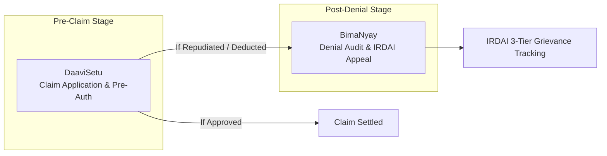
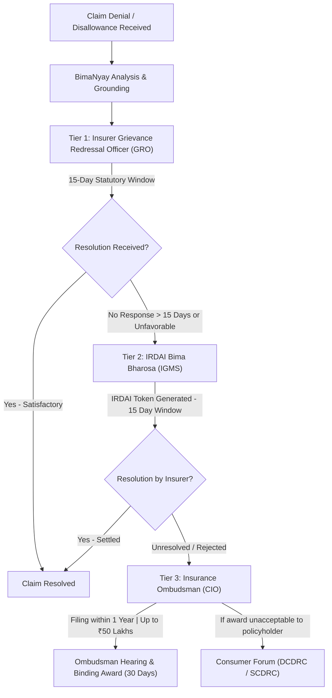
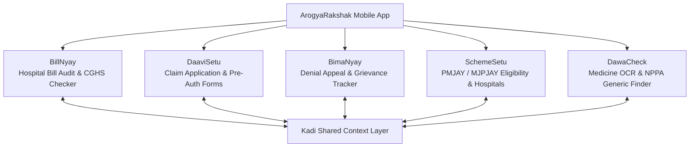

# ArogyaRakshak — BimaNyay & Mobile App Architecture Specification

**Module:** `bimanyay`  
**Mobile Client:** `apps/mobile`  
**Shared Context Layer:** `packages/kadi`  
**Status:** Approved Architectural Specification  

---

## 1. Overview & Purpose

**BimaNyay** (*बीमा न्याय* — "Insurance Justice") is a specialized module within ArogyaRakshak designed to empower patients facing wrongful insurance claim repudiations, arbitrary deductions, or cashless authorization denials.

While **BillNyay** audits hospital line items against CGHS benchmark rates, the insurance workflow is cleanly partitioned into two distinct, non-overlapping lifecycles:
- **DaaviSetu (`packages/daavisetu`) — Pre-Claim Application Phase**: Automates initial cashless pre-authorization and reimbursement claim application form filling by mapping patient diagnosis and billing line items from Kadi into standard insurer claim templates.
- **BimaNyay (`packages/bimanyay`) — Post-Denial Dispute & Grievance Phase**: Activated when an insurance claim is repudiated, underpaid, or subjected to arbitrary deductions. Performs legal & medical audit against IRDAI guidelines, drafts statutory appeals, and tracks turnaround times on regulatory portals.



### 1.1 BimaNyay Scope & Capabilities
1. Ingests and parses insurance policy wordings/schedules and claim repudiation letters using Kadi's shared OCR layer.
2. Identifies violations of the **IRDAI Master Circular on Health Insurance Business (May 29, 2024)** and the **Insurance Act, 1938**.
3. Synthesizes clinical evidence from discharge summaries to refute arbitrary denial rationales (e.g., *"admission solely for observation"*).
4. Auto-generates structured, legally cited 3-tier appeal packages (Insurer GRO, IRDAI Bima Bharosa, and Insurance Ombudsman Form VI).
5. Provides a self-reported milestone and turnaround-time (SLA) tracking engine with statutory escalation countdowns.

### 1.2 Module Boundary Matrix & Harmony Protocol (Zero-Overlap Guarantee)

To preserve architectural clarity and modular cohesion across the project, each module operates strictly within defined boundaries while harmonizing via **Kadi**:

| Module | What It OWNS (Exclusive Scope) | What It DOES NOT DO (Explicit Out-of-Scope) | Harmony Contract (Handoff via Kadi) |
|---|---|---|---|
| **Kadi** | Shared entity extraction, cross-script resolution (IndicXlit + IndicSBERT), case context persistence, consent boundaries. | No domain auditing, no legal rules, no pricing benchmarks, no UI forms. | Provides clean, normalized JSON entities to all downstream modules. |
| **BillNyay** | Hospital bill line-item audit vs **CGHS benchmark rates**, billing anomaly heuristics (ICD-10 vs procedure), overcharge representation to hospital management. | Does not touch insurance repudiation letters, does not draft IRDAI appeals, does not check medicine MRPs. | Writes extracted hospital line items & procedure codes to Kadi for use by DaaviSetu and BimaNyay. |
| **DaaviSetu** | **Pre-claim application**: pre-populating blank cashless pre-authorization and reimbursement claim forms for major private insurers. | Does not handle claim disputes, does not appeal denials, does not audit hospital rates or scheme eligibility. | Reads patient diagnosis and bill totals from Kadi to generate submission-ready initial claim forms. |
| **BimaNyay** | **Post-denial dispute**: auditing insurer claim repudiations & deductions against **IRDAI regulations**, drafting 3-tier statutory appeals (GRO, Bima Bharosa, Ombudsman), SLA tracking. | Does not audit hospital bills against CGHS rates (leaves to BillNyay), does not fill pre-auth forms (leaves to DaaviSetu). | Reads hospital bill context and patient records from Kadi to build an evidence-backed dispute dossier. |
| **SchemeSetu** | Government public health welfare scheme eligibility (**PMJAY** national & **MJPJAY** Maharashtra), empanelled hospital locator. | Does not handle private commercial health insurance, does not parse insurance policy wordings. | Reads diagnosis and procedural estimate from Kadi; alerts patient if a denied private procedure is 100% free under MJPJAY. |
| **DawaCheck** | Retail medicine pricing audit vs **NPPA Schedule-I ceiling rates**, bioequivalent generic substitute suggestions, Jan Aushadhi store locator. | Does not audit hospital procedures, does not touch insurance claim forms or government schemes. | Reads prescribed medications from Kadi; suggests generic alternatives to lower hospital pharmacy bills. |

---

## 2. IRDAI Grievance Redressal Architecture & Citizen Guide

Under Indian insurance jurisprudence, a policyholder cannot jump straight to consumer court or the Insurance Ombudsman without following the statutory escalation ladder:



### 2.1 The Three Statutory Escalation Tiers

#### Tier 1: Insurer Grievance Redressal Officer (GRO)
- **Mandate**: Every insurer must maintain a Grievance Redressal Cell headed by a designated GRO at corporate and branch levels.
- **Statutory Timeline**: 
  - Acknowledgment within **3 working days**.
  - Final resolution or rejection within **15 calendar days**.
- **Key 2024 Rule**: Under the IRDAI 2024 Master Circular, **no claim can be rejected without prior review and approval by the Claims Review Committee (CRC)**. Blanket or unexplained repudiations violate this mandate.

#### Tier 2: IRDAI Bima Bharosa (Integrated Grievance Management System)
- **Portal**: [https://bimabharosa.irdai.gov.in](https://bimabharosa.irdai.gov.in)
- **Toll-Free Helpline**: `155255` or `1800 4254 732` (Mon–Sat, 8 AM – 8 PM)
- **Email**: `complaints@irdai.gov.in`
- **Mechanism**: The policyholder registers their grievance with policy number and Insurer GRO complaint details. IRDAI issues a unique **IRDAI Token Number** and monitors the insurer's turnaround time. The insurer is held accountable to regulatory SLAs (15 days).

#### Tier 3: Council for Insurance Ombudsmen (CIO)
- **Portal**: [https://cioins.co.in](https://cioins.co.in)
- **Authority**: Established under the **Insurance Ombudsman Rules, 2017** (amended 2021).
- **Eligibility & Constraints**:
  - Complainant must have first approached the insurer GRO.
  - Complaint must be lodged within **1 year** of receiving the insurer's final rejection or 1 month after GRO non-response.
  - Total claim dispute amount (claim + expenses) cannot exceed **₹50 Lakhs**.
  - No simultaneous petition pending in civil court or consumer forum.
- **Cost**: **100% Free** for policyholders.
- **Outcome**: The Ombudsman award is **fully legally binding on the insurance company** within 30 days. However, the policyholder is not bound; if dissatisfied, they can still approach the Consumer Commission.

### 2.2 Key IRDAI Regulatory Grounds Enforced by BimaNyay
1. **5-Year Moratorium Rule**: Contesting pre-existing diseases is barred after 5 continuous years of policy renewal (reduced from 8 years in May 2024).
2. **Cashless SLAs**: 1 hour for initial cashless pre-authorization decision; 3 hours for final discharge approval. Any hospital room rent incurred due to insurer delays beyond 3 hours must be borne by the insurer.
3. **Delayed Settlement Interest**: Insurers failing to settle claims within 30 days of complete document submission must pay penal interest at **Bank Rate + 2%** compounded annually.
4. **Mandated Modern Treatments**: Blanket exclusions for robotic surgeries, stem cell therapies, and specialized radio-surgeries are invalid under IRDAI guidelines.
5. **No Proportionate Deduction on Consumables/ICU**: Room rent sub-limits cannot be disproportionately applied to ICU charges, diagnostic tests, or scheduled medications.

---

## 3. BimaNyay System Architecture (`packages/bimanyay`)

### 3.1 Pipeline Overview
Following the project convention, BimaNyay deploys a 5-agent sequential chain with strictly typed Pydantic payloads:

```
[Denial Letter + Policy + Discharge Summary]
                     ↓
       [Kadi Shared OCR & Entity Extractor]
                     ↓
        [1. ClauseAuditorAgent]
          (Matches cited clause vs inception dates & exclusions)
                     ↓
      [2. ClinicalGroundsReviewer]
          (Validates medical necessity against discharge vitals & IVs)
                     ↓
       [3. RegulatoryAdvisorAgent]
          (Cites IRDAI 2024 Circulars, Section 45, and Ombud Rules)
                     ↓
        [4. GrievanceDrafterAgent]
          (Drafts GRO Appeal, Bima Bharosa Package, Ombudsman Form VI)
                     ↓
         [5. LegalQAJudgeAgent]
          (Audits citations, facts, and anti-hallucination score)
                     ↓
    [Submission Package PDF + Grievance SLA Tracker]
```

### 3.2 Database Schema (`bimanyay_*`)
- `bimanyay_cases`: Anchors policy, insurer, TPA, claim amounts, and denial classification to `kadi_cases`.
- `bimanyay_analyses`: Retains audit findings, cited regulatory clauses, reversal probability score, and generated appeal text.
- `bimanyay_grievances`: Manages escalation tier state (`LEVEL_1_GRO`, `LEVEL_2_BIMA_BHAROSA`, `LEVEL_3_OMBUDSMAN`), token numbers, and computed statutory deadlines.
- `bimanyay_timeline_events`: Audit trail of user milestone updates and communications.

---

## 4. ArogyaRakshak Mobile App Architecture (`apps/mobile`)

The mobile application is designed as a **fully functional cross-platform patient companion** supporting all five modules under a unified, intuitive native UI.

### 4.1 Technology Stack
- **Framework**: React Native with **Expo** (TypeScript)
- **Camera & Scanning**: `react-native-document-scanner-plugin` / `expo-camera` with automated border detection, skew correction, and contrast enhancement.
- **State & Networking**: TanStack Query (React Query) + Axios client connected to `/api/v1/`.
- **Local Storage & Privacy**: Encrypted `expo-secure-store` for transient session tokens. Zero persistent storage of patient health documents on mobile device or server outside active session.
- **Localization**: `i18next` with English, Hindi, and Marathi terminology dictionaries.
- **Navigation**: React Navigation (Bottom Tabs with Native Stack per module workflow).

### 4.2 Fully Functional Multi-Module Scope



| Module Screen | Mobile-Specific Features & Capabilities |
|---|---|
| **1. BillNyay** | - Edge-detection camera scanner for multi-page hospital discharge bills.<br/>- Line-by-line CGHS government benchmark price comparison.<br/>- Interactive visual flag breakdown for inflated room rent, procedures, and consumables. |
| **2. DaaviSetu** | - Automatic cashless pre-authorization and reimbursement claim application filler.<br/>- Maps patient context from Kadi directly into standard insurer claim templates.<br/>- One-tap submission-ready PDF export and sharing via WhatsApp/Email. |
| **3. BimaNyay** | - Camera capture of insurance repudiation / denial letters and policy schedules.<br/>- Plain-language AI audit citing violated IRDAI 2024 regulations.<br/>- Generates 3-tier appeal packages (GRO Appeal, Bima Bharosa description, Ombudsman Form VI).<br/>- Statutory Grievance SLA Countdown widget with background push notifications. |
| **4. SchemeSetu** | - 4-step voice/touch intake questionnaire (ration card color, income, state/district).<br/>- Real-time PMJAY & MJPJAY coverage verification.<br/>- Geolocation-based empanelled hospital directory map with one-tap calling. |
| **5. DawaCheck** | - Medicine strip packaging and prescription OCR scanner.<br/>- Real-time MRP vs NPPA Schedule-I price control checker.<br/>- Generates generic substitute recommendations and locates nearby PMBJP Jan Aushadhi Kendras. |

### 4.3 Mobile-First Patient UX Enhancements
1. **Edge-Detection Document Scanner**: Instant camera scanning of multi-page hospital bills and denial letters with contrast enhancement.
2. **Plain-Language Dispute Explainer**: Visual cards explaining wrongful repudiation in simple regional language terms.
3. **Statutory SLA Countdown Widget**: Dynamic timeline showing days remaining for insurer response and one-tap escalation to Bima Bharosa.
4. **Portal Assistance Toolkit**: One-tap copy of formatted 2,000-character complaint texts specifically structured for the Bima Bharosa online form text areas.
5. **Trilingual Voice Assistance**: Audio prompt assistance in Hindi and Marathi for low-literacy users navigating hospital billing and claim appeals.
