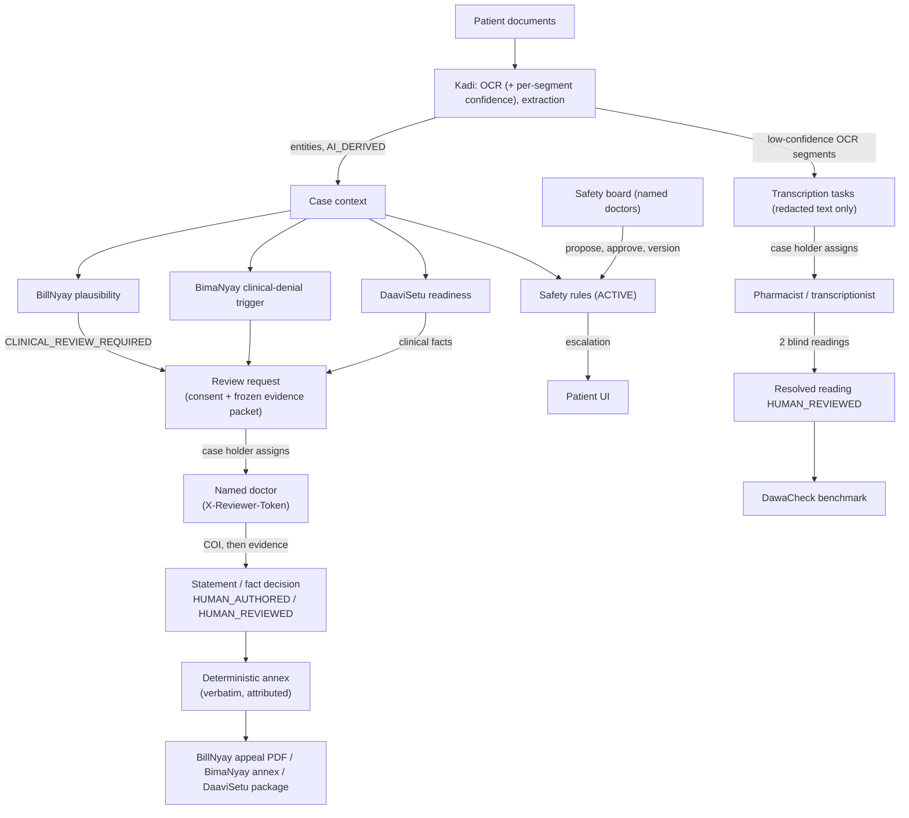
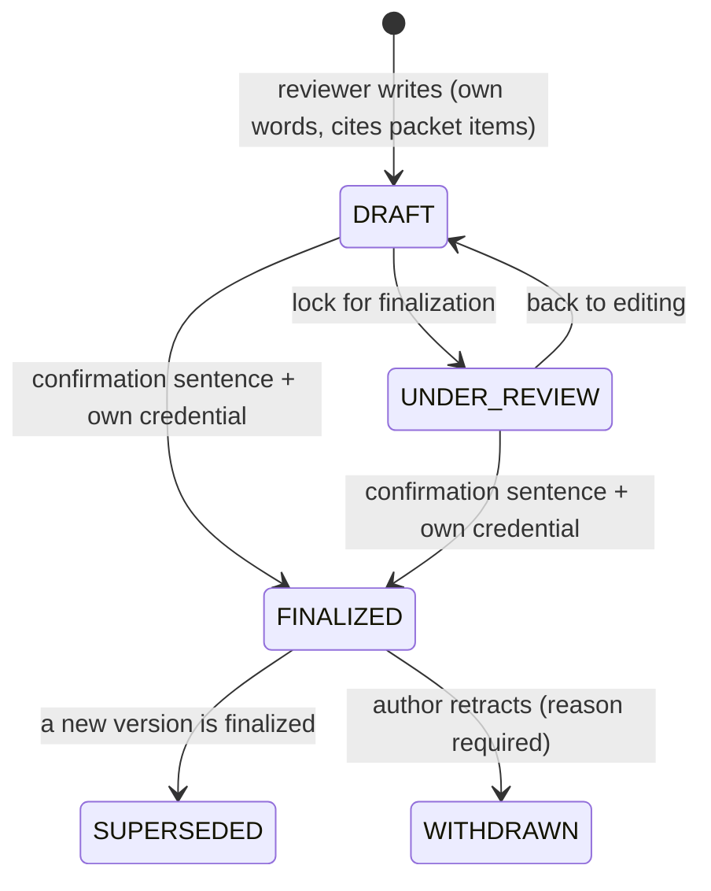
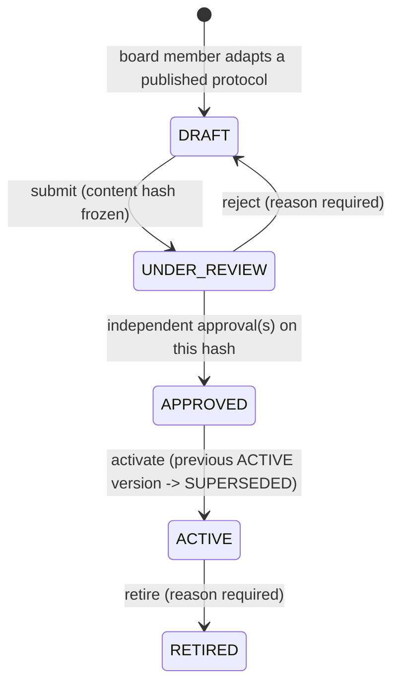

# Clinical Review, Safety Governance & Human OCR Resolution

Decision record: [ADR-011](decisions/ADR-011-clinical-review-and-safety-governance.md).

> **The principle.** Machine-derived evidence and accountable human judgment are different
> kinds of thing. ArogyaRakshak routes cases to named humans where judgment is needed,
> keeps the two apart all the way into the documents a patient files, and never lets
> software write, sign, or imply a clinician's opinion.

---

## 1. Who does what

| Task | Software (AI / rules) | Named human |
|---|---|---|
| Extract diagnoses, procedures, medicines, bill lines | ✅ Kadi OCR + extraction (`AI_DERIVED`) | — |
| Flag diagnosis ↔ intervention inconsistency | ✅ plausibility check (bounded, cited) | — |
| Say whether an intervention was *clinically justified* | ❌ never | ✅ doctor's own statement (`HUMAN_AUTHORED`) |
| Detect that a denial turns on clinical judgment | ✅ BimaNyay trigger | — |
| Write the clinical rebuttal to that denial | ❌ never | ✅ doctor's own statement |
| List documents commonly needed for pre-auth | ✅ checklist (baseline + institution playbook) | desk staff author private playbooks |
| Confirm a clinical fact the claim relies on | ❌ never marked satisfied by software | ✅ doctor's decision (`HUMAN_REVIEWED`) |
| Read an illegible prescription word | ❌ low-confidence OCR is not trusted | ✅ pharmacist / transcriptionist / annotator, two blind readings for medication fields |
| Decide which red flags stop an admin workflow | ❌ | ✅ rules adapted from published protocols, approved by a named board |
| Show a red-flag escalation | ✅ evaluates ACTIVE rules | — |
| Verify a reviewer's registration | ❌ no registry integration exists | — (shown as self-declared) |

Humans are not approving AI output anywhere in this layer. They either **author** something
AI is not allowed to produce (statements, fact decisions, readings, rules) or they are not
involved.

---

## 2. Architecture



| Layer | Location |
|---|---|
| Domain rules (DB-agnostic) | `packages/kadi/kadi/clinical_review/` — `types`, `lifecycle`, `evidence`, `verification`, `safety`, `transcription`, `annex` |
| Module logic | `packages/billnyay/billnyay/plausibility.py`, `packages/bimanyay/bimanyay/clinical_triggers.py`, `packages/daavisetu/daavisetu/readiness.py` |
| Persistence & services | `apps/api/app/clinical/` — `auth`, `audit`, `serializers`, `context`, `service`, `safety_service`, `transcription_service`, `purge`, `demo`; `apps/api/app/daavisetu_playbooks.py` |
| HTTP | `apps/api/app/api/v1/endpoints/clinical_review.py`, `clinical_safety.py`, `clinical_transcription.py`, `clinical_demo.py` (all under `/api/v1/kadi`); additions in `billnyay.py`, `bimanyay.py`, `daavisetu.py`, `dawacheck.py`, `kadi.py` |
| Web | `apps/web/app/lib/clinical.ts`, `app/components/clinical/*`, `app/clinical-review/page.tsx` (reviewer workspace) |
| Mobile | `apps/mobile/src/components/ClinicalReviewCard.tsx`, `ClinicalWorkflowCards.tsx`; screen integrations |

### Tables (all new; no existing table altered)

| Table | Scope | Purpose |
|---|---|---|
| `kadi_clinical_reviewers` | global | Named reviewer, category, declared registration, verification status, credential hash, board seat |
| `kadi_clinical_reviews` | case | Consented request, frozen evidence packet, COI context, assignment, COI declaration |
| `kadi_clinical_statements` | case | Versioned statement, reviewer snapshot, confirmation, content hash |
| `kadi_clinical_fact_confirmations` | case | Clinical fact + reviewer decision |
| `kadi_clinical_audit_events` | case / global | Append-only events; ids, statuses and counts only |
| `kadi_safety_rules`, `kadi_safety_rule_approvals` | global | Versioned rules, attributable approvals bound to a content hash |
| `kadi_safety_scan_results` | case | Upload-time full-text rule matches: rule id, version, matched terms only |
| `kadi_transcription_tasks`, `_assignments`, `_submissions` | case | Uncertain readings, assigned readers, one reading per reader |
| `daavisetu_institutions`, `daavisetu_playbooks` | global (institution-private) | Desk credential; versioned private checklists |

---

## 3. Credentials and authorization

There are still no user accounts (ADR-008). Three bearer credentials exist, each shown
once and stored only as a SHA-256 hash:

| Credential | Header | Holder | Grants |
|---|---|---|---|
| Case token | `X-Case-Access-Token` | patient / case holder | their case, as before (ADR-009) |
| Reviewer credential | `X-Reviewer-Token` (header only) | a registered reviewer | only the reviews/tasks a case holder **assigned to them** |
| Institution credential | `X-Institution-Token` (header only) | a hospital desk | only its own playbooks |
| Governance key | `X-Governance-Admin-Key` | operator | seat board members, attempt verification, seed demo; **disabled when unset** |

Object-level checks on every request:
- case-holder routes load reviews by `(case_id, review_id)` — an id from another case is 404;
- reviewer routes require `assigned_reviewer_id == reviewer`, an accessible state, and the
  case still existing with consent — otherwise 404 (ids cannot be probed);
- statement routes additionally require `statement.reviewer_id == reviewer` — a reviewer
  cannot edit or finalize another reviewer's draft (403);
- playbook routes filter by the caller's institution — another hospital's playbook is 404.

---

## 4. Reviewer verification — what is and is not known

| Status | How it is reached | Label shown everywhere |
|---|---|---|
| `UNVERIFIED` | registered without a registration number | "Identity and registration not verified" |
| `SELF_DECLARED` | registered with a registration number | "Self-declared registration — not verified by ArogyaRakshak" |
| `DEMO_VERIFIED` | operator, only with `CLINICAL_DEMO_MODE=true` | "Demo verification only — not checked against any real medical registry" |
| `EXTERNALLY_VERIFIED` | only a real `RegistryVerificationAdapter` — **none exists** | "Registration verified against {source} on {date}" |

`POST /kadi/clinical-reviewers/{id}/verification {"mode": "external"}` calls the shipped
`UnavailableRegistryAdapter`, which returns `EXTERNAL_VERIFICATION_UNAVAILABLE` and changes
nothing. Anyone can register claiming to be a doctor, so self-registration is never
treated as trustworthy by listing:

- `GET /kadi/clinical-reviewers` lists **only** `EXTERNALLY_VERIFIED` reviewers (none exist
  in this build) — plus demo fixtures while `CLINICAL_DEMO_MODE` is on. A self-declared
  "Dr. <real name>" therefore never appears to patients as a choice.
- A patient assigns their own doctor/pharmacist by the **reviewer ID** that person gives
  them (shown in the reviewer workspace). The looked-up profile, with its honest label, is
  shown before assigning.
- Demo reviewers are unusable (not listed, not look-up-able, credential rejected) the
  moment demo mode is turned off.

A finalized statement freezes the reviewer's verification state at signing time.

---

## 5. Conflict of interest

Declared per review, before any clinical evidence is visible:
`TREATING_DOCTOR`, `HOSPITAL_AFFILIATED`, `INSURER_AFFILIATED`, `INDEPENDENT_REVIEWER`,
`OTHER` (free-text disclosure required). Reviewers may also record standing disclosures on
their profile. The COI is frozen into each statement / fact decision and printed wherever
it appears — patient UI, appeal annex, readiness package.

---

## 6. Statement lifecycle



- Required confirmation, sent by the reviewer: *"I confirm that this statement represents
  my own professional judgment based on the information reviewed."*
- `evidence_reviewed` may only cite items from the review's frozen packet.
- Finalization stores a reviewer snapshot and a SHA-256 over the statement's content.
- The case holder sees only FINALIZED / SUPERSEDED / WITHDRAWN versions; drafts are private.
- Only a FINALIZED statement on a non-cancelled review is ever presented as a current
  opinion or put in a package.

---

## 7. Plausibility review (BillNyay)

`GET /api/v1/billnyay/cases/{id}/clinical-plausibility` → `PLAUSIBLE`,
`INSUFFICIENT_INFORMATION`, `POTENTIAL_INCONSISTENCY` or `CLINICAL_REVIEW_RECOMMENDED`, plus
`clinical_review.status = CLINICAL_REVIEW_REQUIRED | NOT_REQUIRED`. Every result lists the
evidence used and the reference used (the project-curated ICD-10 table, labelled as such),
carries `is_necessity_determination: false` and the disclaimer *"This is a limited
plausibility assessment and is not a clinical necessity determination."* Guideline
citations can only come from a registered guideline record; none is registered, so none
is cited. An active safety escalation raises the case to review.

Bill lines that are administrative charges (room, bed, nursing, consultation, ICU stay,
diet, pharmacy, …) are set aside as `excluded_administrative_items`, never treated as
interventions. A PLAUSIBLE result lists every billed intervention the curated table does
not cover as `not_assessed_items` (`coverage: PARTIAL`) and says in its summary that they
were not assessed — so "appendectomy + MRI brain" is not presented as all-clear.

## 8. Preauth readiness (DaaviSetu)

`POST /api/v1/daavisetu/cases/{id}/readiness` evaluates a generic baseline plus, with the
institution's credential, one of its ACTIVE, in-date playbooks. Item statuses: `PRESENT`,
`MISSING`, `NEEDS_CLINICAL_CONFIRMATION`, `CONFIRMED_BY_REVIEWER`, `REJECTED_BY_REVIEWER`,
`REVIEWER_COULD_NOT_DETERMINE`. Keyword evidence is reported as `KEYWORD_MATCH` (weak).
Keywords are searched only in the extracted entities and the first 1,000 characters of each
document (the redacted excerpt that is kept); every report carries `evidence_scope_note`
saying so, and "missing" means "not found there", not "absent from your documents".
Clinical facts are routed with
`POST .../readiness/clinical-confirmations` — the fact wording comes from the server-side
checklist, never the request. The claim package ZIP now includes `preauth_readiness.txt`
reflecting real reviewer decisions. No output mentions approval probability.

## 9. Safety governance



Each rule stores `source_name`, `source_reference`, `source_version`, `source_section`,
`limitations`, `effective_date`, `review_due_date`, `changelog`. Triggers are structured
keyword lists over case text (validated; no code). Escalations return only matched terms —
never surrounding patient text — plus source, version, limitations, a negation caveat and
the floor disclaimer. `GET /kadi/cases/{id}/safety-escalations` is not consent-gated; with
no active rules it says *"the absence of an escalation is therefore not a safety
assessment of any kind."*

**Coverage.** Every uploaded document is scanned **in full** against the rules active at
upload time, while it is still in memory; only the rule id, version and matched terms are
stored (`kadi_safety_scan_results`, erased with the case). Rules activated later see only
the extracted entities and the 1,000-character excerpt. Results from rules that were since
retired or superseded are ignored. The response's `scope_note` states this. If the check
fails, web and mobile say so explicitly — a failure never renders like "no escalation".

**Approval rounds.** The submitted content hash includes a submission round (counted from
the rule's own `RULE_SUBMITTED` audit events). After a rejection, resubmitting unchanged
content starts a fresh round: earlier approvals no longer count and the reviewer who
rejected can decide again.

## 10. Human OCR resolution

- Kadi keeps EasyOCR's per-segment confidence (`ocr_segments`). A segment below
  `OCR_LOW_CONFIDENCE_THRESHOLD` becomes a task **only if** it (a) carries no direct
  identifier and is not a prescriber/identity line ("Dr.", degrees, registration no.),
  (b) is not a bare prescription marker ("Rx", "Tab.") or too short to settle, (c) is not a
  non-clinical field (amount, date), and (d) links — every meaningful token, as a whole
  token — to exactly **one** extracted medicine. Unlinked readings have no consumer and
  are dropped instead of becoming work that goes nowhere. At most 10 per document.
- Context shows only neighbouring lines that look like part of a medication entry
  (redacted); letterheads, names and addresses are replaced by "…".
- A task stores the redacted candidate, that masked context (`▢▢▢`) and a bounding box —
  **no image** (ADR-003). Readers read the original the patient holds, so today this works
  in person (e.g. at a pharmacy counter), not remotely.
- A resolved reading replaces **only the uncertain token** inside the medicine's name
  ("Tab Augmntn 625mg" → "Tab Augmentin 625mg"); if it cannot be placed unambiguously the
  entry is left unchanged and the task says so. The reader categories are recorded.
- `MEDICINE_NAME`, `STRENGTH`, `FREQUENCY`, `ROUTE`, `DURATION` and `UNCLASSIFIED` are
  HIGH risk: two independent readings from different readers must agree (normalised for
  case/spacing/units). HIGH-risk readers never see the OCR guess or another reader's
  answer. Disagreement or "unreadable" → `HUMAN_ESCALATION_REQUIRED`.
- A case holder can also flag an extracted medicine as possibly misread (whole entry only;
  partial-field flags are refused because the reading could not be placed safely).
- DawaCheck does not benchmark a medicine with an open or escalated HIGH-risk task, and
  benchmarks a resolved name with `name_provenance: HUMAN_REVIEWED`.

---

## 11. Threat model (tested in `apps/api/tests/test_clinical_security.py`)

| Threat | Mitigation |
|---|---|
| IDOR / cross-case reviewer access | reviewer access requires assignment; case routes key on `(case_id, review_id)`; 404 on mismatch |
| Case A statement in case B | statements load by case; appeal/annex/context queries filter by case |
| Finalizing another reviewer's draft | `statement.reviewer_id` check → 403; declined reviewer loses access (404) |
| Token confusion / query-string tokens | separate headers; reviewer/institution credentials header-only |
| Consent bypass | stored `consent_opt_in` + per-request `share_with_reviewer_consent`; request-body `consent_opt_in` ignored |
| Reviewer impersonation / fake verification | verification cannot be self-set; board seat needs the governance key; labels never upgraded |
| Privilege escalation to safety board | `is_safety_board_member` ignored at registration; board routes require seat + DOCTOR |
| Cross-tenant playbook leakage | institution filter on every playbook read/write; readiness requires that institution's credential |
| Unauthorized evidence access | evidence only after acceptance + COI; cancel revokes immediately |
| Malicious transcription | length bound, control-char strip, one reading per reader (DB unique), stored as literal text |
| Prompt injection via documents/statements | evidence delivered as data with a warning; statements never enter an LLM prompt; Barrister rule forbids implying clinician opinions |
| Unsafe PDF generation | annex XML-escaped before any markup, same as the letter |
| Stale opinion in a signed PDF | finalize / withdraw / supersede / cancel re-renders the stored appeal PDF annex and re-signs it (`app.clinical.events` listener); an older download fails `.../appeal/verify` |
| Insurer-facing self-harm | the "no clinician statement" notice is patient-facing only (`clinical_statement_notice`); the PDF carries an annex only when a statement exists |
| Impersonation via the directory | only independently verified (or demo, in demo mode) reviewers are listed; others are assigned by the ID they share |
| Sensitive audit logging | `audit.sanitize_details` keeps only short scalars; tests assert no statement text, evidence value or name appears |
| Retention | `purge_case` (DELETE and TTL sweep) removes every case-scoped clinical row |

## 12. Limitations and what is NOT claimed

- **No registry verification.** No integration with NMC/State Medical Councils/Pharmacy
  Council exists; `EXTERNALLY_VERIFIED` is unreachable in this build.
- **No identity proofing.** A reviewer is whoever holds the credential; a case holder is
  whoever holds the case token. The system cannot prove the case holder is the patient.
- **No medical-necessity determination, no approval or outcome prediction.**
- **Safety rules are a floor.** Keyword triggers miss paraphrase and ignore negation;
  there is no claim of comprehensive coverage. Demo rules name their sources by title only
  and must be verified by a real board.
- **Readiness baseline is generic**, not insurer-specific; keyword presence is weak evidence,
  and only the 1,000-character excerpt per document is searched.
- **Transcription readers see text, not the image**: the original stays with the patient,
  so reading works in person, not remotely. Two agreeing non-prescriber readers is still
  weaker than confirmation by the dispensing pharmacist.
- **Plausibility covers 6 ICD-10 codes**; most real cases return INSUFFICIENT_INFORMATION.
- **English-only clinical UI** pending native-speaker review of Hindi/Marathi wording.
- **No notifications**: reviewers poll their queue; patients press "Refresh status".
- **No payments / marketplace**, by design.
- **Mobile**: patient-side flows only; reviewer administration is web-only.

## 13. Demo walkthrough (Scenarios A–D)

Executable version: `apps/api/tests/test_clinical_demo_scenarios.py`.

```bash
# API with demo fixtures enabled (never in a real deployment)
CLINICAL_DEMO_MODE=true CLINICAL_GOVERNANCE_ADMIN_KEY=choose-a-long-random-key \
  uvicorn app.main:app --port 8000
curl -X POST localhost:8000/api/v1/kadi/clinical-demo/seed -H "X-Governance-Admin-Key: choose-a-long-random-key"
```

The seed returns demo reviewer credentials (Dr. Demo Clinician A/B — board members,
DEMO_VERIFIED; Demo Pharmacist — SELF_DECLARED; Demo Medical Transcriptionist —
UNVERIFIED), a demo institution credential and playbook, and two ACTIVE demo safety rules
(FAST stroke signs; WHO ETAT emergency signs). Re-running rotates the credentials.

- **A — BillNyay:** upload a bill whose procedure does not fit the diagnosis → BillNyay →
  *Check clinical plausibility* (POTENTIAL_INCONSISTENCY) → *Request Clinical Review* (tick
  consent) → assign Dr. Demo Clinician A → in `/clinical-review`, paste A's credential,
  declare `HOSPITAL_AFFILIATED`, open evidence, write and finalize → back in BillNyay,
  *Draft IRDAI Appeal Letter* shows the attributed annex; the PDF contains it.
- **B — DaaviSetu:** *Check documentation readiness* (optionally with the demo playbook id
  and institution credential) → *Ask a doctor to confirm* → assign Dr. B → B confirms or
  rejects in the workspace → re-check readiness; the claim package ZIP reflects it.
- **C — DawaCheck:** open DawaCheck for a scanned case → flag a medicine → assign Demo
  Pharmacist and Demo Transcriptionist → each submits a reading in the workspace
  *Transcriptions* tab → agreement resolves it (`HUMAN_REVIEWED`), disagreement escalates.
- **D — Safety:** upload a document mentioning "slurred speech" → the red banner shows the
  FAST rule, its version, source and the floor disclaimer.

## 14. Future work

- A real `RegistryVerificationAdapter` once an authorised registry API exists.
- Reviewer notifications; statement signing with a licensed DSC (IT Act, 2000).
- Transient, patient-held image crops for readers (would need an ADR-003 amendment).
- Hindi/Marathi clinical copy after native-speaker review.
- Scoped, revocable consent receipts (ADR-007 stage 1) replacing the boolean + flag.
