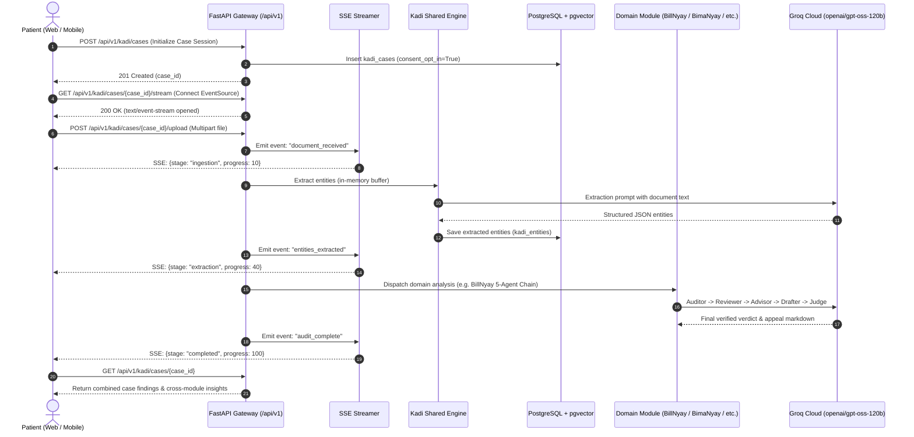

# End-to-End Data Flow & Streaming Protocol

This document details the lifecycle of data moving through **ArogyaRakshak**, from initial patient document upload to real-time status streaming and multi-module report generation.

---

## 1. End-to-End Processing Sequence



---

## 2. Bring-Your-Own-Document (BYOD) Memory Lifecycle

To uphold patient privacy and HIPAA/DISHA data hygiene, patient records are governed by strict transient memory constraints:

```text
[Patient Upload (PDF/Image)]
             ↓
[FastAPI UploadFile (In-Memory Spool / RAM)]
             ↓
[OCR & LLM Extraction Engine]
             ↓
[Extracted Structured Entities (kadi_entities table in DB)]
             ↓
[Raw Uploaded File Buffer immediately EXPLICITLY PURGED from Memory]
```

- Raw binary files are **never written to the server's disk**.
- Structured records in `kadi_entities` contain only de-identified clinical metadata (procedure codes, medicines, prices) linked to the transient `case_id`.

---

## 3. Server-Sent Events (SSE) Protocol

Long-running reasoning pipelines (which can take 3 to 10 seconds across multiple agent hops) broadcast real-time updates over HTTP SSE.

### Connection Endpoint
```http
GET /api/v1/kadi/cases/{case_id}/stream
Accept: text/event-stream
```

### Event Payload Schema
Each message dispatched on the stream is a JSON payload adhering to this schema:
```json
{
  "case_id": "c7a8e241-789a-4f56-b8f1-8f567b4c91a0",
  "stage": "clinical_review",
  "progress": 65,
  "message": "Validating procedural necessity against CGHS benchmarks...",
  "timestamp": "2026-09-09T11:20:00Z"
}
```

### Event Pipeline Stages
1. `document_received` (10%): Multipart file verified and loaded into transient RAM.
2. `ocr_parsing` (25%): Devanagari / Latin tokens parsed from layout.
3. `entity_extraction` (50%): Kadi normalizes patient data, procedure codes, and bills.
4. `domain_auditing` (75%): Domain-specific multi-agent reasoning (BillNyay CGHS check or BimaNyay IRDAI audit).
5. `completed` (100%): Output appeal packages and reports finalized for client consumption.
6. `error`: Emitted with an explanatory error message if processing fails.
