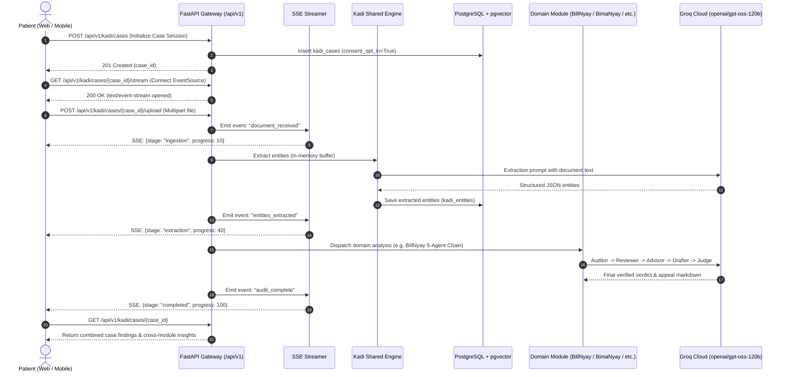

# End-to-End Data Flow & Streaming Protocol

This document details the lifecycle of data moving through **ArogyaRakshak**, from initial patient document upload to real-time status streaming and multi-module report generation.

---

## 1. End-to-End Processing Sequence


```mermaid
sequenceDiagram
    autonumber
    actor Patient as Patient (Web / Mobile)
    participant API as FastAPI Gateway (/api/v1)
    participant SSE as SSE Streamer
    participant Kadi as Kadi Shared Engine
    participant DB as PostgreSQL + pgvector
    participant Module as Domain Module (BillNyay / BimaNyay / etc.)
    participant LLM as Groq Cloud (openai/gpt-oss-120b)

    Patient->>API: POST /api/v1/kadi/cases (Initialize Case Session)
    API->>DB: Insert kadi_cases (consent_opt_in=True)
    API-->>Patient: 201 Created (case_id)

    Patient->>API: GET /api/v1/kadi/cases/{case_id}/stream (Connect EventSource)
    API-->>Patient: 200 OK (text/event-stream opened)

    Patient->>API: POST /api/v1/kadi/cases/{case_id}/upload (Multipart file)
    API->>SSE: Emit event: "document_received"
    SSE-->>Patient: SSE: {stage: "ingestion", progress: 10}

    API->>Kadi: Extract entities (in-memory buffer)
    Kadi->>LLM: Extraction prompt with document text
    LLM-->>Kadi: Structured JSON entities
    Kadi->>DB: Save extracted entities (kadi_entities)
    API->>SSE: Emit event: "entities_extracted"
    SSE-->>Patient: SSE: {stage: "extraction", progress: 40}

    API->>Module: Dispatch domain analysis (e.g. BillNyay 5-Agent Chain)
    Module->>LLM: Auditor -> Reviewer -> Advisor -> Drafter -> Judge
    LLM-->>Module: Final verified verdict & appeal markdown
    API->>SSE: Emit event: "audit_complete"
    SSE-->>Patient: SSE: {stage: "completed", progress: 100}

    Patient->>API: GET /api/v1/kadi/cases/{case_id}
    API-->>Patient: Return combined case findings & cross-module insights
```

---

## 2. Bring-Your-Own-Document (BYOD) Memory Lifecycle

To uphold patient privacy and HIPAA/DISHA data hygiene, patient records are governed by strict transient memory constraints:

```text
[Patient Upload (PDF/Image)]
             ↓
[FastAPI UploadFile (In-Memory Spool / RAM)]
             ↓
[OCR & LLM Extraction Engine]
             ↓
[Extracted Structured Entities (kadi_entities table in DB)]
             ↓
[Raw Uploaded File Buffer immediately EXPLICITLY PURGED from Memory]
```

- Raw binary files are **never written to the server's disk**, and uploads are bounded by size
  and file type.
- Records in `kadi_entities` hold clinical and billing metadata (diagnosis, hospital, procedures,
  medicines, line items) linked to the `case_id`. The patient name is **not** persisted, and the
  retained document excerpt is passed through `kadi.redaction.redact_pii`, which strips names,
  phone numbers, emails, Aadhaar/PAN identifiers and addresses.
- This removes *direct* identifiers only; it is not formal anonymisation.

---

## 3. Server-Sent Events (SSE) Protocol

Long-running reasoning pipelines (which can take 3 to 10 seconds across multiple agent hops) broadcast real-time updates over HTTP SSE.

### Connection Endpoint
```http
GET /api/v1/kadi/cases/{case_id}/stream
Accept: text/event-stream
```

### Event Payload Schema
Each message dispatched on the stream is a JSON payload adhering to this schema:
```json
{
  "status": "extraction_start",
  "progress": 60,
  "log": "Extracting clinical & billing entities with Kadi agent..."
}
```

### Event Pipeline Stages
1. `upload_received` (10%): Multipart file accepted and queued.
2. `ocr_start` (30%): Text extracted from the document (PDF / image / plain text).
3. `extraction_start` (60%): Kadi extracts clinical and billing entities.
4. `database_write` (80%): De-identified entities persisted against the case.
5. `completed` (100%): Processing finished.
6. `failed` (100%): Processing failed; `log` carries the reason.
7. `timeout` (100%): Stream exceeded `SSE_TIMEOUT_SECONDS` and was closed.

Domain analysis (BillNyay audit/appeal, DaaviSetu claim) does **not** run on this stream — each
is a separate client-initiated request after extraction completes.
