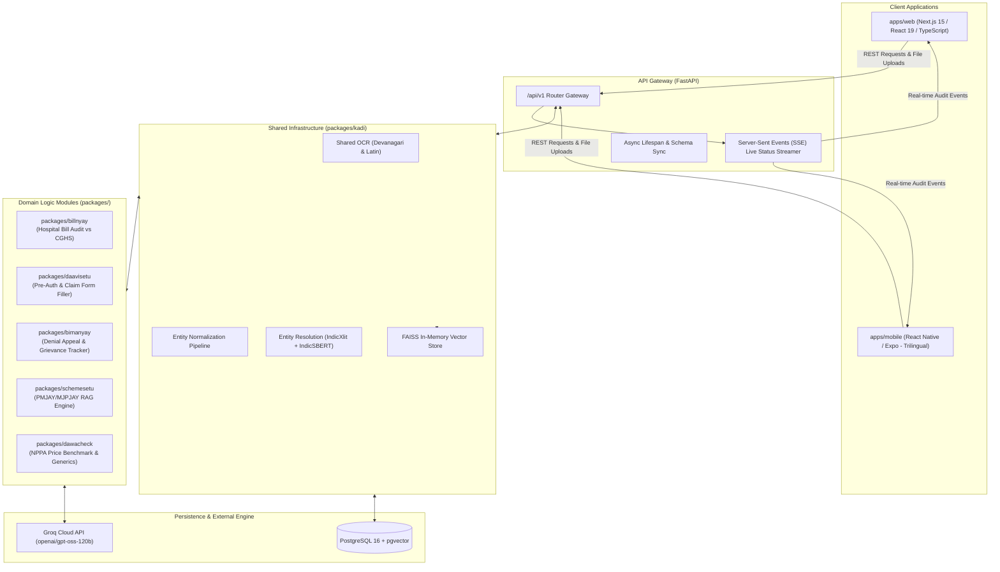

# System Architecture Overview

ArogyaRakshak (आरोग्यरक्षक) is an automated healthcare decision-support platform designed for Indian patients navigating medical billing, health insurance claims, government welfare schemes, and pharmaceutical pricing.

---

## 1. Architectural Philosophy

1. **Interoperability over Isolation**: Individual healthcare problems (overbilled hospital charges, denied insurance claims, high medicine costs) do not happen in isolation. Rather than operating as isolated silos, all domain modules interoperate through **Kadi**—a shared intelligence and context layer.
2. **Bring-Your-Own-Document (BYOD) Privacy**: Uploaded patient medical records, discharge summaries, and bills are held strictly in transient memory buffers during the active case session and expunged immediately afterward. No persistent document storage is maintained.
3. **Trilingual from Day One**: All user-facing interfaces and generated output summaries are designed for English, Hindi, and Marathi native speakers.
4. **Strict Model Grounding**: All multi-agent reasoning is grounded in authentic, public government benchmarks (CGHS rate schedules, NPPA ceiling price orders, PMJAY/MJPJAY rules, and IRDAI master circulars).

---

## 2. High-Level Architecture Diagram



---

## 3. Technology Stack

| Layer | Technology | Version | Purpose & Rationale |
|---|---|---|---|
| **Backend Gateway** | **FastAPI** | `0.115.x` | High-performance async Python web framework with automatic OpenAPI documentation. |
| **ASGI Server** | **Uvicorn** | `0.34.x` | Production-grade ASGI server with uvloop event loop. |
| **ORM & Driver** | **SQLAlchemy + asyncpg** | `2.0.x` / `0.30.x` | Fully asynchronous relational database management. |
| **Database** | **PostgreSQL + pgvector** | `pg16` | Relational persistence combined with native vector similarity searches. |
| **Vector Index** | **FAISS** | — | Lightning-fast in-memory similarity matching for sub-second candidate blocking. |
| **LLM Inference** | **Groq API** | Default: `openai/gpt-oss-120b` | High-throughput cloud inference engine. Deprecated Llama models are prohibited. |
| **Transliteration** | **IndicXlit (AI4Bharat)**| — | Phonetic cross-script transliteration for Indian regional languages. |
| **Cross-Lingual Embeddings** | **IndicSBERT (L3Cube)** | — | High-precision Hindi/Marathi/English semantic sentence similarity. |
| **Web Frontend** | **Next.js (App Router)** | `15/16` / React `19` | Modern React client with trilingual i18n scaffolding. |
| **Mobile App** | **React Native + Expo** | TypeScript | Cross-platform mobile client with camera document edge detection. |
| **Containerization** | **Docker Compose** | Compose v2 | Multi-container local orchestration (Postgres, API, Web). |

---

## 4. Repository Monorepo Structure

```text
arogyarakshak/
├── apps/
│   ├── api/                     # FastAPI backend application
│   ├── web/                     # Next.js 15 frontend application
│   └── mobile/                  # React Native / Expo mobile application
├── packages/                    # Python domain libraries (installed as editable via pip -e)
│   ├── kadi/                    # Shared context, OCR, extraction & entity resolution
│   ├── billnyay/                # 5-agent hospital bill auditing chain
│   ├── daavisetu/               # Claim pre-authorization form generator
│   ├── bimanyay/                # Claim denial dispute analysis & IRDAI appeals
│   ├── schemesetu/              # RAG eligibility agent & local embedding fallback
│   └── dawacheck/               # NPPA Schedule-I price verification & generics
├── data/                        # Government rate schedules & benchmark datasets
├── docs/                        # Technical specifications, ADRs & guides
└── docker-compose.yml           # Multi-service container orchestration
```

For individual module breakdowns, see [Component Specifications](components.md).
