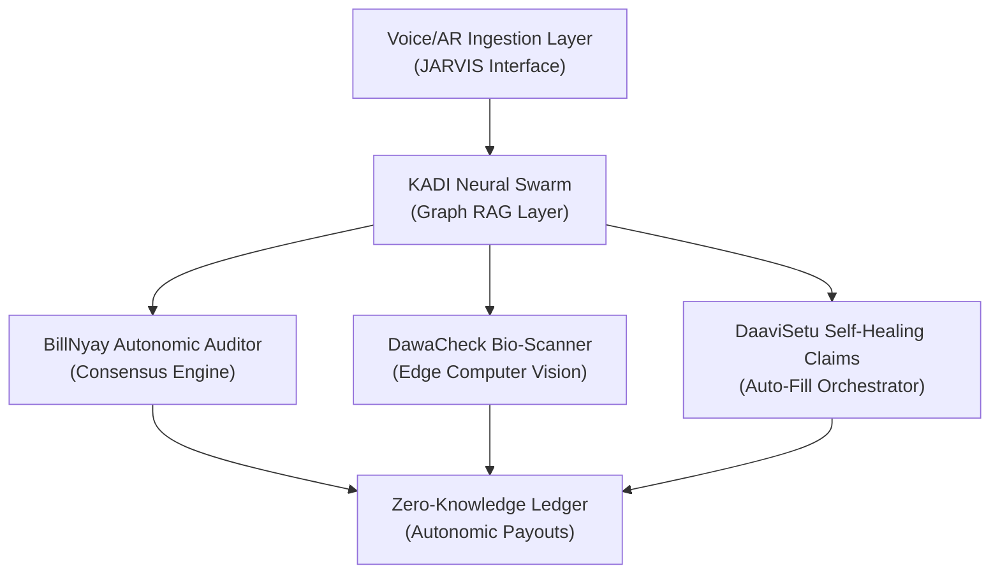

# ArogyaRakshak — Futuristic Scope & R&D Roadmap ("Project Mark-85")

This document details the high-concept, futuristic R&D roadmap for **ArogyaRakshak**—representing the ultimate, zero-friction, multi-agent AI system for patient advocacy, clinical integrity, and claim automation.

---

---

## 1. JARVIS-Style Voice & AR Ingestion (The Holographic Console)

Instead of manual uploads and static forms, the intake is powered by an interactive, real-time voice and augmented reality interface.

- **Multilingual Voice Core (IndicSpeech-ASR)**:
  - Patients speak naturally in regional dialects (e.g., Varhadi Marathi or Awadhi Hindi). The system uses real-time local ASR to extract clinical symptoms and intent.
- **AR Medical Document Scanner**:
  - Utilizing phone cameras or smart glasses (Apple Vision Pro/Meta Quest), the user sweeps over their hospital room table. The system dynamically highlights billing codes in red/green overlays:
    - *Red*: Flagged overpricing or unbundled procedures.
    - *Green*: Fully CGHS-compliant items.

---

## 2. KADI Neural Swarm (Cognitive Graph Resolution Layer)

Moving beyond simple database queries, KADI evolves into a decentralized semantic network of patient case histories.

- **Dynamic Cross-Lingual Knowledge Swarm**:
  - Multi-script semantic entity graphs map local doctor prescriptions to standard international clinical definitions (ICD-11, SNOMED-CT) using localized IndicBioBERT.
- **Self-Tuning RLHF Confidence Loops**:
  - The graph dynamically modifies its matching thresholds by learning from patient interactions and lawyer critiques, resolving duplicate patient entities without a centralized server.

---

## 3. BillNyay Autonomic Auditor (Consensus Engine)

The 5-agent pipeline transforms into a fully autonomic legal critique loop operating with zero human latency.

- **Barrister-Judge Synthesis**:
  - The Barrister agent drafts the appeal, the Clinician reviews it, and the QA Judge critiques it. If the Judge scores the draft below 98% grounding, the system triggers an internal rewrite loop automatically.
- **Predictive Legal Outcome Simulation**:
  - Prior to filing, the system runs a Monte Carlo simulation of the IRDAI dispute based on historical dispute databases, displaying a real-time "Success Probability Gauge" to the user.

---

## 4. DawaCheck Bio-Scanner (Edge Computer Vision)

DawaCheck operates at the physical layer to detect counterfeit medicines and analyze pill consistency.

- **Spectral medicine strip verification**:
  - Deploying lightweight MobileNet/YOLOv8 vision models to classify medicine strip holograms, detecting counterfeits or tampered expiry dates.
- **Dosage-to-Pill Consistency Checker**:
  - Users place pills on their phone screen. OpenCV filters analyze color, shape, and diameter to verify if the physical pill matches the doctor's prescription active dosage.

---

## 5. DaaviSetu Self-Healing Claims (Zero-Friction Submission)

Pre-authorization claim packages auto-generate and self-correct prior to submission to prevent administrative denials.

- **Neural Form-Field Re-Mapping**:
  - If an insurance company alters their cashless claim PDF format, the system uses layout-aware visual-LLMs to automatically discover, test, and re-map the input coordinates in real-time.
- **Zero-Knowledge Proof (ZKP) Policy Validation**:
  - Verify patient income levels and pre-existing condition exclusions against the insurer's policy limits on a zero-knowledge ledger, validating eligibility without exposing private medical logs.

---

## 6. Autonomic Smart Contract Claims (Web3 Settlement)

The final state of ArogyaRakshak integrates with automated payout protocols.

- **Zero-Trust Cashless Dispatch**:
  - When the ABDM Sandbox registers a verified discharge summary (FHIR record), a blockchain-gated smart contract automatically matches the pre-auth claim package, bypasses the insurer's manual approval backlog, and releases payouts instantly.
