# ArogyaRakshak — Weekly Sprint Playbook & Kickoff Guide

This playbook outlines how to organize your team's weekend sprints to complete one Phase every weekend.

---

## 1. Setup Your GitHub Project Board (Do This First)

Before coding, create a **GitHub Project Board** to track assignments:
1. Go to your repository on GitHub -> **Projects** -> **New Project**.
2. Select the **Board** layout.
3. Import all issues from `Viraj281105/Arogyarakshak`.
4. Group columns by **Milestone** (so you have columns for Phase 0, Phase 1, Phase 2, etc.).
5. Filter by **Assignee** during standups to see what each person is doing.

---

## 2. Weekend-by-Weekend Sprint Roadmap

```mermaid
gantt
    title Weekend Sprint Schedule
    dateFormat  X
    axisFormat %d
    section Development
    Weekend 1 (Phase 0 & 1)           :active, w1, 0, 2
    Weekend 2 (Phase 2 - Backend/UI)   :w2, 2, 4
    Weekend 3 (Phase 3 - Integration) :w3, 4, 6
    Weekend 4 (Phase 4 - Multilingual):w4, 6, 8
    Weekend 5 (Phase 4.5 & 5 - QA/Docs):w5, 8, 10
```

### Weekend 1: Phase 0 (Blockers) & Phase 1 (Foundations)
* **Goal**: Get the environment fully ready and compile the source datasets.
* **Sprint Steps**:
  - **You (Viraj)**: Setup the Docker Compose workspace (`Postgres + pgvector + FastAPI + Next.js`), configure local package structures, and verify database connection pools.
  - **Sanjali**: Fetch the actual NPPA pricing CSVs, CGHS rate sheets, and PMJAY/MJPJAY rules, making sure they are clean and readable.
  - **Anurag & Arya**: Configure the repository locally, check that the Next.js visual server starts up, and verify ABDM Sandbox API credentials.

### Weekend 2: Phase 2 (Module Builds)
* **Goal**: Build all standalone endpoint logic for the 4 core modules.
* **Sprint Steps**:
  - **You (Viraj)**: Port the hackathon OCR pipeline, implement the 5-agent BillNyay consensus flow, and connect SchemeSetu and DawaCheck logic.
  - **Arya & Anurag**: Collaborate on the Next.js pages (forms for claim pre-population, pricing variance widgets, intake forms).
  - **Sanjali**: Refine the LLM agent prompt templates for clinical audits and appeal letters.

### Weekend 3: Phase 3 (Entity Resolution & Integration)
* **Goal**: Connect all modules through KADI's shared context layer.
* **Sprint Steps**:
  - **You (Viraj)**: Build KADI string similarity scoring, transliteration matching (IndicXlit), and patient context triggers.
  - **Anurag**: Deploy local BioBERT models for Clinical Entity Extraction and run visual classification models for DawaCheck.
  - **Arya**: Build the user consent UI and cross-module insight cards (e.g. suggesting scheme eligibility when an invoice is uploaded).
  - **Sanjali**: Curate the named entity-pair test sets.

### Weekend 4: Phase 4 (Multilingual & QA)
* **Goal**: Ground all outputs in Devanagari (Hindi/Marathi) and secure inputs.
* **Sprint Steps**:
  - **You (Viraj)**: Implement LLM translation loops and security sanitization layers for Devanagari inputs.
  - **Arya**: Run a full UI pass to ensure all screens render correctly in English, Hindi, and Marathi.
  - **Sanjali**: Conduct terminology QA on generated appeal drafts and scheme documents.
  - **Anurag**: Create the Devanagari OCR test sets and evaluate character error rates.

### Weekend 5: Phase 4.5 (Evaluation) & Phase 5 (Polish & Submission)
* **Goal**: Calculate accuracy scores against test sets and prepare the university report.
* **Sprint Steps**:
  - **Anurag**: Run evaluation harnesses (PEA, BMA, PCRA, MRR) and collect final latency numbers.
  - **Sanjali**: Draft the final SPPU college Blackbook report and thesis document.
  - **Arya**: Record the end-to-end demo walkthrough video.
  - **You (Viraj)**: Finalize target deployments (cloud free-tier / local server) and run code optimization checks.

---

## 3. Recommended Weekly Workflow

To keep vibe coders aligned without daily standups, use this workflow:
1. **Friday Night Kickoff (30 mins)**: Meet on Zoom/Discord. Everyone checks their assigned issues in the current Phase column on the Project Board.
2. **Saturday Development**:
   - You build the core backend interfaces/schemas first.
   - Vibe coders build the static Next.js pages, write prompt lists, or collect PDFs.
3. **Sunday Integration & PRs**:
   - Integrate the vibe coders' UI components with your backend endpoints.
   - Run `pytest` to make sure all 16 tests pass before merging.
4. **Sunday Retrospective (15 mins)**: Move completed issues to "Done" and verify that the target Phase Milestone is 100% complete.
